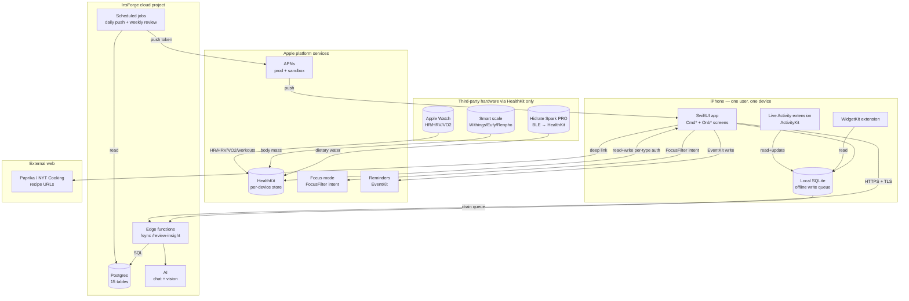
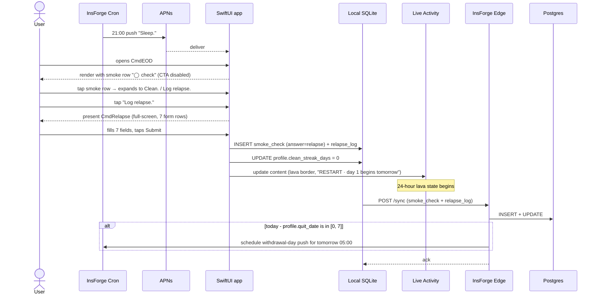
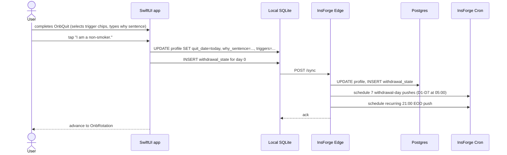
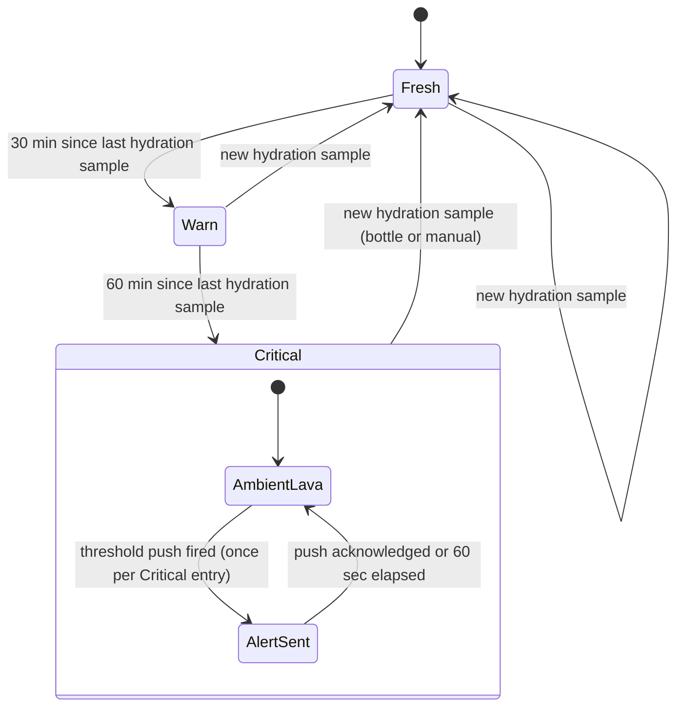
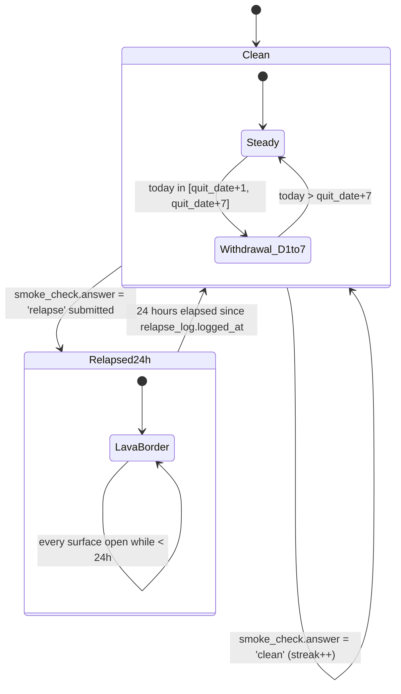
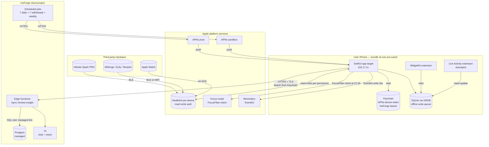

# Act. product design — v2

## Vision

Act. is a single-user, dark-mode-only iOS coach that runs one human's day from 5:00 wake to 21:30 lights-out: weigh-in, gym, swim recovery, hydration, the single 18:00 meal, the post-meal walk, end-of-day smoke check. The user is a 310 lb male cutting to 180 lb on OMAD (one meal a day, 18:00–19:00), training three days a week (Full Body A/B with a 30 min zone-2 swim recovery on lift days), and quitting hookah from install day forward. Success means weight trends from 308 toward 180 at a sustainable rate over months, the daily check streak (weigh + lift on lift days + meal + EOD) stays above 90%, and the cessation clean-day count grows toward 365 with relapses logged honestly when they happen. The app is the only accountability surface for both the cut and the quit — there is no coach, no peer group, no leaderboard, no public log; accountability lives entirely between the user and the home-screen Live Activity. The product ships TestFlight-only to one device, sized to last twelve months without an App Store submission.

## Hard lines

- **Native iOS, SwiftUI on iOS 17.4+.** No PWA, no web stack, no web-push, no service worker, no Capacitor / React Native / Flutter. APNs is the only push channel. SwiftUI is the only UI framework.
- **Single user, TestFlight only.** No accounts, no auth flows, no multi-tenant database tables, no `user_id` columns, no sharing surface, no leaderboard, no social, no App Store distribution.
- **OMAD, not three meals.** One meal between 18:00 and 19:00 (configurable in `profile.meal_window_start` / `profile.meal_window_end`). No breakfast / lunch / dinner words anywhere in the schema, the UI, the push copy, or the AI prompts.
- **One imperative per moment, one screen per moment.** Every Today screen has one hero word ending in a period (`Eat.`, `Walk.`, `Sleep.`, `Hydrate.`, `Lift.`, `Swim.`, `Reheat.`, `Cook.`) and one sticky lime CTA. The Today coordinator picks the right screen; the user never sees a dashboard, a list of choices, or a menu of activities. Settings and Rotation editor are the only screens exempt from the hero-word rule (they are hubs).
- **Cessation pillar is enforced.** The 21:00 EOD smoke row on `CmdEOD` is the only forced choice in the app. The lime `OK` CTA is disabled until the user taps either `Clean.` (increments `profile.clean_streak_days` by one) or `Log relapse.` (opens the full-screen `CmdRelapse` form). The app cannot end the day without an answer.
- **No cessation shame language.** Allowed: "Honest.", "No shame. Just data.", "Tomorrow is easier.", "Today is the worst day." Banned: "slip", "moment of weakness", "it's okay", "try again tomorrow", "you got this", "stay strong", "be brave". The `CmdRecovery` screen is informational, not celebratory; no badges, trophies, fireworks, or congratulatory animations on clean-day milestones.
- **No streaks-as-gamification.** Streaks (`profile.clean_streak_days`, `profile.adherence_pct_cached`) render as static SF Mono numbers. They never pulse, animate, flash, badge, or fire confetti. The 47 on `CmdRecovery` is the same kind of object as the 308.4 on `CmdWeighIn`: a number.
- **No recipe content in-app.** No cooking instructions, no cook verbs as hero words (no `Sear.`, `Marinate.`, `Brown.`, `Bake.`), no ingredient lists with quantities, no cook times, no temperatures, no step-by-step directions, no reheating times. The user owns recipes in Paprika / NYT Cooking; Act. only deep-links via `rotation.recipe_url`. The single exception is the deep-link row on `CmdCook` when a URL is configured.
- **Visual system is locked.** Background `#000000`. Surfaces `#0A0A0A`, `#141414`, `#1C1C1E`. Single accent `oklch(0.88 0.18 130)` (lime). Two contingent accents: amber `oklch(0.78 0.16 60)` (hydration 30+ min stale) and lava `oklch(0.68 0.22 25)` (hydration 60+ min stale, relapse 24h border). No other colors. No cards, no shadows, no elevated surfaces — only hairline-bordered rows. No emoji.
- **Type is locked.** All numbers in SF Mono. All words in SF Pro Display (UI text and tags in SF Pro Text). Hero words at display 72/84/96/120, weight 800, letter-spacing -3 to -5. Sticky CTA is 56h × 18r, lime fill, black text, display 18 weight 700.
- **One CTA per screen.** Secondary actions are mono text links above the sticky CTA. Tertiary affordances are inline row expansions (e.g., the smoke row on `CmdEOD`).

## System architecture

The system is a single SwiftUI app on one iPhone (with two app extensions: WidgetKit for home-screen and lock-screen widgets, and a Live Activity extension built on ActivityKit for the Dynamic Island and lock-screen surface), backed by a single InsForge cloud project (Postgres + edge functions + scheduled jobs + AI), bridged to physical hardware via Apple HealthKit (the Hidrate Spark PRO water bottle and the Withings/Eufy/Renpho smart scale both publish into HealthKit; Act. reads from HealthKit, never directly from the hardware). APNs delivers the seven daily prompts plus event-driven pushes (hydration critical, withdrawal-day morning). Recipe URLs deep-link out to Paprika / NYT Cooking; iOS Focus mode and the Reminders app are written to from the SwiftUI app via system frameworks (FocusFilter and EventKit respectively). Local storage is SQLite (via GRDB) for offline-first writes that drain to InsForge Postgres through the `/sync` edge function when the network is available. The diagram below shows the static component graph; the "Key flows" section shows how data moves at runtime.



## Data model

InsForge Postgres is the source of truth for all logged data. Local SQLite mirrors it with offline-first writes that drain through the `/sync` edge function. Every row is owned by the single user; there is no `user_id` column anywhere — multi-tenant separation is explicitly out of scope (see "Out of scope"). The `PROFILE` table has exactly one row by invariant, enforced by a Postgres unique index on a constant column. The diagram below names every entity and its fields; key constraints worth restating are listed in prose below.

```mermaid
erDiagram
  PROFILE ||--o{ WEIGHT_LOG : "logs"
  PROFILE ||--o{ LIFT_SESSION : "performs"
  LIFT_SESSION ||--|{ LIFT_LOG : "contains sets"
  PROFILE ||--o{ SWIM_SESSION : "performs"
  PROFILE ||--o{ WALK_SESSION : "performs"
  PROFILE ||--o{ HYDRATION_LOG : "drinks"
  PROFILE ||--o{ MEAL_LOG : "eats"
  PROFILE ||--o{ DEVIATION_LOG : "deviates"
  PROFILE ||--o{ SMOKE_CHECK : "answers daily"
  SMOKE_CHECK ||--o| RELAPSE_LOG : "details when relapse"
  PROFILE ||--o{ URGE_LOG : "logs cravings"
  PROFILE ||--o{ ROTATION : "configures"
  PROFILE ||--o{ GROCERY_LIST : "shops"
  PROFILE ||--o{ WITHDRAWAL_STATE : "tracks D1-7"
  PROFILE {
    uuid id PK "always the single row"
    int height_in "user height in inches"
    string sex "M | F | other"
    int age "years; derived from birthdate"
    decimal start_weight_lb "310; immutable post-onboarding"
    decimal goal_weight_lb "180"
    time wake_time "default 05:00"
    time meal_window_start "default 18:00"
    time meal_window_end "default 19:00"
    time bed_time "default 21:30"
    int kcal_target "default 2150"
    int protein_target_g "default 190"
    date quit_date "install date; immutable post-onboarding"
    string why_sentence "user one-line quit reason"
    json triggers "array of selected chip values"
    int clean_streak_days "cached; computed from SMOKE_CHECK"
    decimal current_weight_lb_cached "cached; from latest WEIGHT_LOG"
    decimal adherence_pct_cached "cached; 7-day rolling"
  }
  WEIGHT_LOG {
    uuid id PK
    timestamp logged_at "UTC stored; displayed in local"
    decimal weight_lb "from scale via HealthKit or manual"
    string source "healthkit | manual_pad"
    boolean is_morning_weigh_in "true if within 30 min of wake_time"
  }
  LIFT_SESSION {
    uuid id PK
    date session_date
    string day_label "A | B"
    int duration_min "wall-clock minutes"
    boolean completed "all prescribed lifts logged"
  }
  LIFT_LOG {
    uuid id PK
    uuid lift_session_id FK
    string exercise "Squat|Bench|Row|Plank|FacePull|Deadlift|OHP|LatPulldown|RDL|Tricep"
    int set_number "1-based"
    decimal weight_lb
    int reps
    int rest_sec "between this set and next"
  }
  SWIM_SESSION {
    uuid id PK
    timestamp started_at
    int duration_min
    string mode "recovery | solo"
    int hr_avg_bpm "from Watch; nullable if not worn"
    int hr_max_bpm "nullable"
  }
  WALK_SESSION {
    uuid id PK
    timestamp started_at
    int duration_min "target 20; actual from HealthKit"
    int steps "from HealthKit"
    boolean is_post_meal "true if within 30 min of MEAL_LOG"
  }
  HYDRATION_LOG {
    uuid id PK
    timestamp logged_at
    int oz "ounces this sip/log"
    string source "hidrate_spark | manual_tap | manual_typed"
    int running_total_oz_cached "sum so far today"
  }
  MEAL_LOG {
    uuid id PK
    date meal_date "one row max per date by invariant"
    timestamp logged_at "when user tapped Logged + shake"
    string dish_name "from ROTATION; e.g., Salmon coconut curry"
    int kcal "from ROTATION prescribed kcal"
    int protein_g
    int carbs_g
    int fat_g
    boolean included_shake "post-meal whey shake taken"
  }
  DEVIATION_LOG {
    uuid id PK
    date meal_date "mutually exclusive with MEAL_LOG for the date"
    timestamp logged_at
    string reason "eating_out | social | travel | off_plan"
    string photo_url "InsForge storage URL; nullable"
    int kcal_est "user-estimated"
    int protein_g_est
  }
  SMOKE_CHECK {
    uuid id PK
    date check_date "unique; one row per date"
    timestamp answered_at
    string answer "clean | relapse"
  }
  RELAPSE_LOG {
    uuid id PK
    uuid smoke_check_id FK "the EOD check that opened this form"
    timestamp logged_at
    string trigger "social_invite|stress|boredom|ritual|specific_person|specific_place|other"
    string where_text "cafe / friend / car / etc."
    string who_with_text "names or 'alone'"
    int how_much "value in chosen unit"
    string how_much_unit "bowls | minutes"
    int stress_pre "0-10"
    int craving_pre "0-10"
    int social_pressure_pre "0-10"
    int satisfaction_post "0-10"
    int regret_post "0-10"
    string reflection_text "required; one sentence"
  }
  URGE_LOG {
    uuid id PK
    timestamp logged_at
    int intensity "0-10 dot slider"
    json triggers "array of selected chip values"
    boolean did_breathing "completed the 5-min breathing"
    int breathing_cycles_completed "0-16"
  }
  ROTATION {
    uuid id PK
    int week_index "1-4; cycles indefinitely"
    int slot "1 or 2; two dishes per week"
    string dish_name
    int prescribed_kcal
    int prescribed_protein_g
    int prescribed_carbs_g
    int prescribed_fat_g
    string recipe_url "Paprika / NYT Cooking deep link; nullable"
  }
  GROCERY_LIST {
    uuid id PK
    date shop_date "Saturday of the target week"
    int week_index "1-4 to match ROTATION"
    json items "categorized: proteins/grains/produce/dairy/pantry/bread"
    boolean sent_to_reminders
  }
  WITHDRAWAL_STATE {
    uuid id PK
    int withdrawal_day "1-7; clamped"
    date as_of_date
    string current_hero_word "Day 1|Heavy|Today|Lighter|Sleep|Energy|Through"
    boolean is_worst_day "true on day 3 only"
  }
```



Constraints worth restating:

- `PROFILE` has exactly one row enforced by a Postgres unique index on a constant column (e.g., `CHECK (id = '00000000-0000-0000-0000-000000000001'::uuid)` plus a unique constraint).
- `SMOKE_CHECK.check_date` and `MEAL_LOG.meal_date` are each uniquely indexed: one row per calendar date max. `RELAPSE_LOG` exists only when the matching `SMOKE_CHECK.answer = 'relapse'`.
- `DEVIATION_LOG` and `MEAL_LOG` are mutually exclusive for the same date — a deviation supersedes a meal. The app enforces this client-side (the deviation flow deletes any pre-existing meal log for the date before inserting the deviation).
- `WITHDRAWAL_STATE` rows exist only for days where `(today - profile.quit_date) ∈ [1, 7]`. After day 7 the rows stop being written and `CmdWithdrawal` retires from the Today coordinator's repertoire (see "Stateful surfaces" → Today coordinator).
- `clean_streak_days`, `current_weight_lb_cached`, `adherence_pct_cached`, and `running_total_oz_cached` are cached/computed columns refreshed by an edge function (or trigger) on every write to the underlying tables. They live where they live so the Live Activity, widget, and Today screens read a single row instead of recomputing.

## Key flows

The flows below are the load-bearing interactions. Every other Cmd* screen follows a variant of Flow 1 (write something, mirror to HealthKit, sync) or Flow 3 (scheduled push opens the right screen). Flow 4 (onboarding Quit. step) is included as a fourth because the quit-date capture is a one-shot bootstrap event that the entire cessation pillar depends on.

### Flow 1 — happy path: 18:00 meal window opens, user logs the meal

```mermaid
sequenceDiagram
  actor User
  participant Cron as InsForge Cron
  participant APNs
  participant App as SwiftUI app
  participant Local as Local SQLite
  participant HK as HealthKit
  participant Edge as InsForge Edge
  participant PG as Postgres
  Cron->>APNs: 18:00 push "Eat."
  APNs-->>App: deliver
  User->>App: opens notification
  App->>Local: read today's ROTATION dish + macros
  App-->>User: render CmdMeal (Eat., 2150 kcal, salmon coconut curry)
  User->>App: tap "Logged + shake"
  App->>Local: INSERT meal_log (dish, macros, included_shake=true)
  App->>HK: write dietary energy + dietary water (shake)
  HK-->>App: ok
  App-->>User: dismiss, return to Today coordinator (advances to Walk state)
  Note over App,Edge: async; never blocks the user
  Local->>Edge: POST /sync (meal_log row)
  Edge->>PG: INSERT meal_log
  Edge->>PG: recompute profile.adherence_pct_cached
  PG-->>Edge: ok
  Edge-->>Local: ack
```

### Flow 2 — failure path: hydration bottle disconnects, Live Activity escalates

```mermaid
sequenceDiagram
  participant Bottle as Hidrate Spark PRO
  participant HK as HealthKit
  participant App as SwiftUI app (background)
  participant LA as Live Activity
  participant APNs
  actor User
  Note over Bottle: BLE drops; no sip events
  loop every 5 min (background task)
    App->>HK: query latest hydration sample
    HK-->>App: last_sip = T-25min
  end
  Note over App: T-30: state Fresh → Warn
  App->>LA: update content (amber, "LATE BY 32 MIN", drop in amber)
  alt user opens app or taps Live Activity
    User->>App: open CmdHydration (warn artboard)
    User->>App: tap "Drink now" → "Logged 12oz manually"
    App->>HK: write dietary water 12 oz (source = manual)
    App->>LA: update content (lime, "NEXT SIP 22 MIN")
  else 60 min stale, no manual log
    Note over App: T-60: state Warn → Critical
    App->>APNs: request critical push "Drink."
    APNs-->>User: deliver
    App->>LA: update content (lava, "LATE 1H 12M", hero word changes to "Drink.")
  end
```

### Flow 3 — async/scheduled: 21:00 EOD smoke check, user logs relapse



### Flow 4 — bootstrap: onboarding Quit. step captures immutable quit_date



## Stateful surfaces

Three first-class state machines drive the app's behavior. Each is owned by a single subsystem, and every transition is labeled with the exact trigger.

### Hydration freshness

Owned by the SwiftUI app's `HydrationMonitor` (a background task + HealthKit query that ticks every 5 min). Drives `CmdHydration` artboard color, Live Activity Compact A/B selection, and Row 2 color on the Expanded Live Activity.



### Cessation clean / relapse streak (with withdrawal-day overlay)

Owned by the InsForge edge function as the canonical, with a local mirror for the Live Activity. The first seven days after `profile.quit_date` carry an overlay that surfaces `CmdWithdrawal` from the Today coordinator and uses day-specific hero words.



### Today coordinator (which Cmd* screen the app surfaces right now)

Owned by the SwiftUI app's `TodayCoordinator`. Inputs: wall-clock time, weekday (lift days are Mon/Wed/Fri), today's completed checks from local store, hydration state, cessation state. Output: exactly one Cmd* screen at any moment. `Urge` and `Withdrawal` are modal overlays reachable from any state; the diagram models a single entry edge from `Fasting` for compactness, but in practice the sheet returns to whichever state was current before invocation.

```mermaid
stateDiagram-v2
  [*] --> PreWake
  PreWake --> WeighIn : wall-clock >= profile.wake_time
  WeighIn --> PreWorkout : weight_log written AND today is lift day
  WeighIn --> Fasting : weight_log written AND today is not lift day
  PreWorkout --> Workout : user taps Start on CmdPreWorkout
  Workout --> Swim : lift_session.completed AND swim not yet done
  Swim --> Fasting : swim_session written
  Fasting --> Hydration : hydration state in (Warn, Critical)
  Hydration --> Fasting : hydration state returns to Fresh
  Fasting --> Reheat : wall-clock >= meal_window_start - 30 min
  Reheat --> Eat : wall-clock >= meal_window_start
  Eat --> Walk : meal_log OR deviation_log written
  Walk --> EOD : wall-clock >= 21:00
  EOD --> Sleep : smoke_check.answer set AND user taps OK
  Sleep --> [*] : wall-clock >= profile.bed_time
  Fasting --> Urge : user invokes CmdUrge (modal; reachable from any state)
  Urge --> Fasting : sheet dismissed
  Eat --> Withdrawal : today in withdrawal D1-7 AND user opens optional card
  Withdrawal --> Eat : sheet dismissed
```



## Deployment

Three deployment surfaces ship on the iPhone — the SwiftUI app target, the WidgetKit extension, and the Live Activity extension — all under one bundle ID (`com.act.coach`), signed by the user's Apple Developer account, distributed via TestFlight to one test slot. The InsForge cloud project hosts Postgres + edge functions + scheduled jobs + AI as a single managed unit (no separate compute, no separate cache, no separate object store beyond what InsForge provides for `deviation_log.photo_url`). Hardware (bottle, scale, Apple Watch) is bridged through HealthKit on-device; no Act. component talks to hardware directly. Recipe URLs are passive deep links into third-party apps the user already owns. Credentials: APNs uses an Apple Developer push key stored in InsForge; Edge functions authenticate the device via a bearer token issued at install time and stored in Keychain; HealthKit authorization is per-type and stored by iOS in the per-app authorization registry.



## Behavior and schedule

The app's wall-clock behavior is a fixed schedule plus event-driven escalations. The schedule below is canonical; any change is a v3 design event.

| Trigger | Event | Outcome |
|---|---|---|
| Wake time (default 05:00), every day | `CmdWeighIn` push | App opens to weight hero; scale-published weight pre-filled from HealthKit; CTA "Good." |
| 05:15 on Mon / Wed / Fri | `CmdPreWorkout` push | Day-A or Day-B card with water/sodium/caffeine+creatine checklist; CTA "Start" |
| 07:00 on lift days | Post-workout hydration push | Reminder to drink 16 oz; logged to `hydration_log` via tap or bottle |
| 17:30, every day | `CmdReheat` push | Tonight's dish surfaces (placeholder image + macros + container/location, no how-to); CTA "Start meal." |
| Meal window open (default 18:00), every day | `CmdMeal` push | `Eat.` screen; one tap "Logged + shake" writes `meal_log` + HealthKit dietary energy/water |
| 19:00, every day | `CmdWalk` push | 20-min countdown; auto-logs via HealthKit walking workout |
| 21:00, every day | `CmdEOD` push | Forced smoke choice (`Clean.` or `Log relapse.`); CTA disabled until answered |
| 21:30, every day | Focus mode activates | FocusFilter intent sets Do Not Disturb until next wake |
| Saturday, weekly | `CmdGrocery` accessible from widget | Categorized list for `week_index = (current_week mod 4) + 1` |
| Sunday, weekly | `CmdCook` orchestrator | Phase progress only; recipe deep-link to Paprika / NYT Cooking if URL configured |
| Monday, weekly | `week_index` advances | `ROTATION` queries use new `week_index`; `CmdReview` shows last week's stats |
| Hydration sample silent for 30 min | LA Compact A → Compact B; LA Expanded Row 2 → amber | No push; visual escalation only |
| Hydration sample silent for 60 min | LA Compact B → Compact C; critical push fires once | `CmdHydration` artboard C; hero word changes to `Drink.` |
| `smoke_check.answer = 'relapse'` submitted | Relapse 24h state begins | LA Expanded 2pt lava border; Compact C `RESTART · 0` alternation; `clean_streak_days = 0` |
| 24 hours after `relapse_log.logged_at` | Relapse 24h state ends | LA reverts to normal Compact A / Expanded; `clean_streak_days` begins at 1 next clean EOD |
| `today - quit_date in [1, 7]` | Withdrawal D1-7 overlay active | Optional `CmdWithdrawal` card surfaces on Today; Day 3 is the worst-day hero |
| `today - quit_date == 365` | Year-1 stat | `CmdRecovery` "Heart attack risk halved" row goes lime |
| Sunday EOD, weekly | AI weekly-review insight generation | Edge function calls AI; result cached for Monday `CmdReview` |

## Integrations

Every third-party connection is read-only or write-only over a stable Apple framework; Act. does not implement vendor-specific BLE or REST protocols itself.

| Service | Provides | We read / write | Failure mode |
|---|---|---|---|
| HealthKit (Apple) | Per-device biometrics, workouts, dietary data | Read: body mass, dietary water, dietary energy, walking + lifting workouts, resting HR, HRV, VO2 max. Write: dietary energy (meal), dietary water (shake + manual), lifting/swim/walk workouts | Per-type authorization denied → graceful fallback to manual entry on each surface; recovery stats show "no data yet — wear your Watch on training days" |
| APNs (Apple, prod + sandbox) | Push delivery | Write: 7 daily scheduled pushes + event pushes (hydration critical, withdrawal-day) | Delivery failure → no retry from APNs; Live Activity is the resilient surface (background task updates + activity push tokens) |
| Hidrate Spark PRO bottle | Sip-resolution water intake | Indirect — bottle publishes dietary water to HealthKit; Act. reads HealthKit | Bottle offline → HydrationMonitor falls back to manual logs; freshness state machine continues to escalate on best-known sample |
| Withings / Eufy / Renpho smart scale | Body weight | Indirect — scale publishes body mass to HealthKit; Act. reads HealthKit | Scale offline → `CmdWeighIn` shows the last cached value with mono "STALE · TAP TO ENTER"; CTA opens `CmdWeightPad` |
| Apple Watch | Resting HR, HRV, VO2 max, workout types | Read via HealthKit | Watch not worn → recovery stats blank with explanatory text; lift/swim/walk sessions still log via app-side timers |
| Paprika / NYT Cooking | Recipe storage (external) | Write-only deep links from `rotation.recipe_url`; no read | URL missing → "Recipes" row hidden entirely on `CmdCook` |
| InsForge AI (chat + vision) | Weekly review insight + meal-deviation photo OCR | Write: prompts and photos. Read: text completions and parsed kcal/protein estimates | AI offline → `CmdReview` shows stats without insight callout; `CmdDeviate` photo OCR fails silently, user types kcal/protein manually |
| iOS Focus mode (FocusFilter intent) | Do Not Disturb activation | Write: schedule DnD at 21:30 daily | Permission denied → silent; nothing surfaces (no Focus is acceptable degradation) |
| Reminders app (EventKit) | Grocery list export | Write: categorized list as a Reminders list on Saturday | Permission denied → `CmdGrocery` "Send to Reminders" CTA disabled with mono explanatory text |
| InsForge Postgres + Edge | Persistence + sync | Read + write all 15 tables via `/sync` and `/review-insight` edge functions | Backend offline → writes queue in local SQLite; reads degrade to cached schedule + rotation + clean_streak_days from local mirror |

## Failure modes

Each failure is paired with the system's response. The general posture is fail-open for user-facing surfaces (the app keeps working in degraded mode) and queue-then-retry for backend writes.

- **HealthKit authorization denied (any specific type).** Graceful per-surface fallback: `CmdWeighIn` shows `CmdWeightPad` instead of pre-fill; `CmdHydration` falls back to manual taps; `CmdRecovery` HR/HRV/VO2 blocks show "no data yet"; `CmdWalk` shows manual start/stop instead of auto-tracking. The screen never errors; it presents a degraded mode silently.
- **Hidrate Spark PRO bottle disconnects (BLE drop).** `HydrationMonitor` continues to query HealthKit; the 30/60-min escalation runs on best-known sample. When the user logs manually (single tap on `CmdHydration` or in-app sub-CTA), the state machine resets to Fresh. No error surfaced to the user — the system just escalates on the data it has.
- **APNs delivery failure.** Pushes are advisory. The Live Activity, widget, and Today coordinator continue to surface the right thing without a push. A missed 18:00 push still results in `CmdMeal` being the right screen when the user next opens the app at any time in the meal window.
- **Smart scale offline at 05:00.** `CmdWeighIn` shows the last cached weight with a mono "STALE · TAP TO ENTER" tag; the sticky CTA opens `CmdWeightPad` for manual entry. The seven-day average uses the cached series.
- **InsForge backend offline.** Local SQLite continues to accept writes via the offline queue. Reads (today's rotation, cached macros, `clean_streak_days`) degrade to the local mirror. Sync resumes automatically when the network returns; conflict resolution is last-write-wins on a per-row basis (acceptable because there is one user / one device).
- **Apple Watch not worn.** Resting HR, HRV, VO2 max stats hide on `CmdRecovery` with mono explanatory text. Lift/swim/walk sessions are still recorded by app-side timers (using `LIFT_SESSION.duration_min` etc.); HR averages are nullable.
- **Photo upload fails on `CmdDeviate`.** The user can still submit without a photo; `deviation_log.photo_url` is nullable. If the user attached a photo and upload failed, the row writes locally without the URL and a background task retries the upload; on success the URL is patched in.
- **Relapse-log network failure during submit.** The 7-field form persists locally on Submit. The `clean_streak_days = 0` mutation and the Live Activity lava-state transition happen immediately from local state. Sync retries; the row reaches Postgres eventually. The user is never blocked by a network condition during a relapse log — that would be the wrong moment to add friction.
- **AI weekly-review generation fails or returns low-quality text.** `CmdReview` renders the four stat rows without the insight callout. Stale insights (>14 days) are also suppressed. No fallback canned text — the system would rather show no insight than fake one.
- **Daylight Saving Time / timezone shift.** Schedule triggers run on wall-clock in the device's current timezone. The 7-push schedule re-anchors on `TimeZone.current` and the next push fires at the new wall-clock time. Mid-day timezone change (travel) leaves the day's already-fired pushes alone; the next not-yet-fired push uses the new zone. See "Open questions" for the edge case where the user crosses the international date line.
- **Forced-choice CTA exploit.** The 21:00 EOD `CmdEOD` is the only screen with a disabled CTA. If the user dismisses the app entirely without answering, the next app open while wall-clock is in [21:00, 24:00] returns the user to `CmdEOD`. A missed day (`smoke_check` row absent for yesterday) does NOT auto-fill — it remains a hole, surfaced on `CmdProgress` as a gap in the adherence count.
- **HealthKit double-counting (bottle + manual tap in the same minute).** `HydrationMonitor` de-dupes hydration samples by `(timestamp, oz, source)` when computing the daily running total; manual taps within 60 seconds of a bottle sample of the same volume are treated as the same sip.

## Out of scope

The following are explicit non-features. Any plan that proposes one of these triggers a `verdict: block` on the next design review.

- App Store distribution. TestFlight to one device only.
- Multi-user / accounts / auth flows / multi-tenant schema. There is one user; `user_id` is not a column anywhere.
- Sharing, leaderboards, social features, friends, peer accountability, public log, coach chat.
- In-app recipe content: cooking instructions, ingredient lists with quantities, cook times, temperatures, step-by-step directions, cook verbs as hero words, reheating times.
- Light mode. Dark only.
- Multiple meal patterns. OMAD only. No breakfast / lunch / dinner concepts in code or copy.
- Beeminder / external-stakes integration. The onboarding `OnbQuit` screen acknowledges this as a v3+ topic and does nothing else.
- Variation B (stack) and Variation C (mission) UI explorations. Variation A · Command ships.
- App Clips, Siri Shortcuts beyond the grocery-export Reminders write.
- PWA / web stack / web-push / service worker / VAPID. Native iOS only.
- Marketing copy in-app. "No menus. No choices." appears only as the `OnbWelcome` sub-line, never on Today screens.
- Design-canvas chrome accidentally adopted as product: the `DCArtboard id="intro"` panel in `Act.html` (CONCEPT tag, marketing tagline, A/B/C variation descriptions); `LACompactsBoard`, `LAExpandedBoard`, `WidgetsBoard` wrappers; all `DCSection`, `DCArtboard`, `DCEditable`, `DCPostIt`, `DCFocusOverlay` pan/zoom infrastructure; `ios-frame.jsx` 360-wide pill backdrop styles; `tweaks-panel.jsx` (lava/ice/bone color exploration). Porter ships only the inner `Cmd*`, `Onb*`, `LACompact*`, `LAExpanded*`, `Widget*` components.
- Streak gamification surfaces: badges, trophies, confetti, fireworks, congratulatory animations, pulsing/animated streak numbers.
- Cessation shame language: "slip", "moment of weakness", "it's okay", "try again tomorrow", "you got this", "stay strong", "be brave".
- Multiple CTAs per screen (sticky lime button is the only call to action; secondary actions are mono text links).

## Open questions

These are genuine ambiguities that v2 leaves for future resolution. Each is annotated with who or what would settle it.

- **Day-1825 milestone presentation.** Should the 5-year clean milestone get a one-time hero treatment on the Today coordinator (e.g., a single full-screen `CmdMilestone` shown once and never again), or stay as a row going lime on `CmdRecovery`? Resolver: user (calibration moment when the actual horizon is closer). v2 default: the row going lime, no separate screen.
- **Adherence floor that triggers AI tone shift.** When `profile.adherence_pct_cached` drops below some threshold (70%? 60%?) should the `CmdReview` AI insight tighten its register or stay matter-of-fact regardless? Resolver: user, after reviewing first month of generated reviews. v2 default: matter-of-fact at all percentages.
- **Cross-timezone day boundary semantics.** If the user flies from PST to JST mid-day, the `21:00 EOD` push fires twice (once in PST, once in JST), or zero times if the wall-clock 21:00 falls inside the lost hours of westbound travel. Should the second fire suppress, double-fire, or roll the day forward by one? Resolver: user during first international travel event. v2 default: whatever `Cron + TimeZone.current` produces (likely a double-fire the user dismisses, or a miss the user catches at next app open per the forced-choice exploit handling).
- **DST day handling.** On spring-forward Sunday, the meal window is one wall-clock hour shorter on the device (the 18:00 trigger fires, but 19:00 is reached in 59 elapsed minutes). Acceptable, or should the meal window expand by one hour that day? Resolver: user on the next DST event. v2 default: acceptable, no special case.
- **Withdrawal D1-7 if the user relapses inside that window.** The `WITHDRAWAL_STATE` row keeps incrementing (today is still day N from `quit_date`), but `clean_streak_days` resets to 0. Does the Day-3 "Today is the worst day" hero still fire on the original day-3, or does the withdrawal clock also reset to day 0? v2 default: withdrawal-day count remains tied to `quit_date` (physiological), `clean_streak_days` resets (behavioral). Resolver: user on first observation; reconsider if the split feels wrong in practice.
- **`CmdReview` cold-start.** Insufficient data for an interesting AI insight in week 1. v2 default: omit the AI callout for the first three weeks and show only the four stat rows. Resolver: first three weeks of usage will tell us whether week-3 insights are actually useful or whether the threshold should be later.
