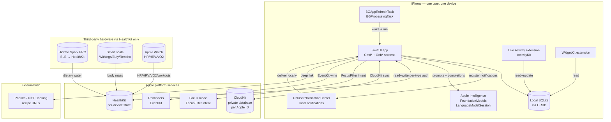
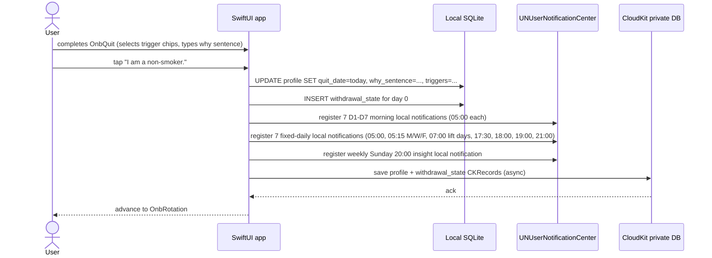
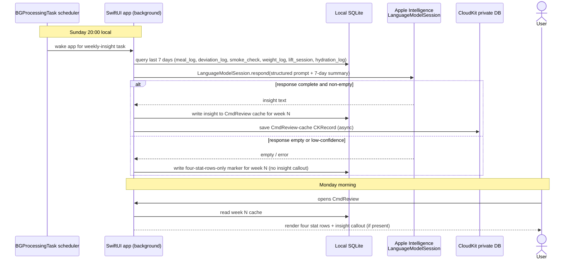
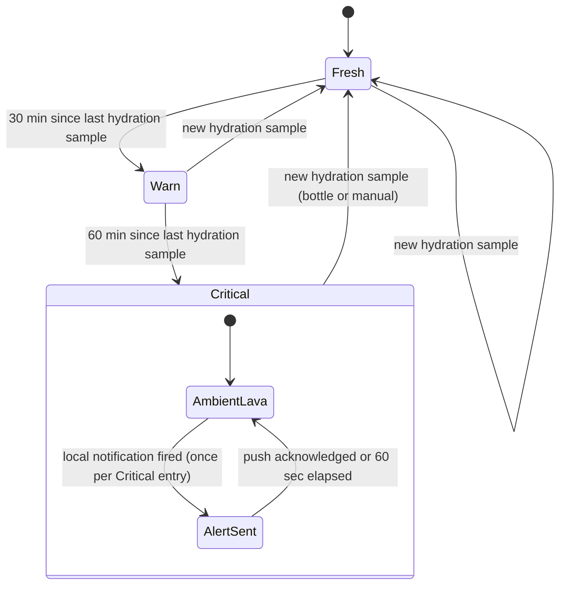
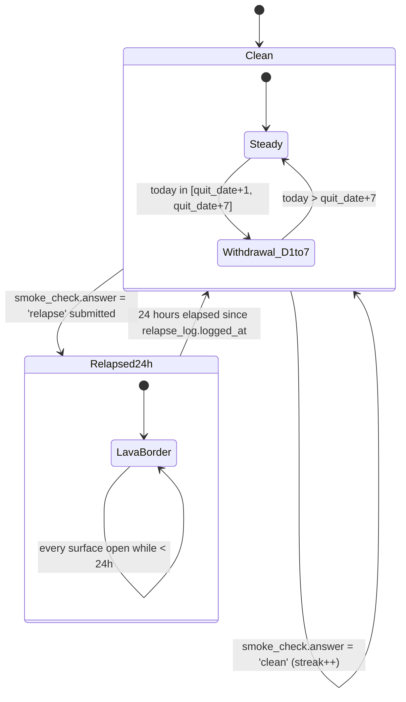

# Act. product design — v3

## Vision

Act. is a single-user, dark-mode-only iOS coach that runs one human's day from 5:00 wake to 21:30 lights-out: weigh-in, gym, swim recovery, hydration, the single 18:00 meal, the post-meal walk, end-of-day smoke check. The user is a 310 lb male cutting to 180 lb on OMAD (one meal a day, 18:00–19:00), training three days a week (Full Body A/B with a 30 min zone-2 swim recovery on lift days), and quitting hookah from install day forward. Success means weight trends from 308 toward 180 at a sustainable rate over months, the daily check streak (weigh + lift on lift days + meal + EOD) stays above 90%, and the cessation clean-day count grows toward 365 with relapses logged honestly when they happen. The app is the only accountability surface for both the cut and the quit — there is no coach, no peer group, no leaderboard, no public log; accountability lives entirely between the user and the home-screen Live Activity. The product ships TestFlight-only to one device, sized to last twelve months without an App Store submission. v3 keeps the user's visible day identical to v2; only the backend stack changes (Apple-native end-to-end, zero third-party cloud).

## Hard lines

- **Native iOS, SwiftUI on iOS 18.1+ with A17 Pro / M-series chip (hard floor).** No PWA, no web stack, no web-push, no service worker, no Capacitor / React Native / Flutter. SwiftUI is the only UI framework. The hardware floor is a HARD requirement because Apple Intelligence (`FoundationModels.LanguageModelSession`) is the only AI source in the app and has no remote fallback. TestFlight enforces the minimum-OS and minimum-device check; on incompatible hardware the install is refused.
- **No third-party cloud backend.** No InsForge, no Supabase, no Firebase, no self-hosted Postgres, no AWS / GCP / Azure compute, no third-party object store. CloudKit (Apple) is the ONLY cross-device + backup channel. All scheduled prompts are iOS local notifications via `UNUserNotificationCenter`, never APNs. All AI is on-device via Apple Intelligence `FoundationModels`; there is no remote inference path. The single user pays $99/yr for the Apple Developer Program and $0/month for everything else.
- **Single user, TestFlight only.** No accounts, no auth flows, no multi-tenant database tables, no `user_id` columns, no sharing surface, no leaderboard, no social, no App Store distribution. The CloudKit private database is implicitly per-Apple-ID; the app does not implement its own identity.
- **OMAD, not three meals.** One meal between 18:00 and 19:00 (configurable in `profile.meal_window_start` / `profile.meal_window_end`). No breakfast / lunch / dinner words anywhere in the schema, the UI, the notification copy, or the AI prompts.
- **One imperative per moment, one screen per moment.** Every Today screen has one hero word ending in a period (`Eat.`, `Walk.`, `Sleep.`, `Hydrate.`, `Lift.`, `Swim.`, `Reheat.`, `Cook.`) and one sticky lime CTA. The Today coordinator picks the right screen; the user never sees a dashboard, a list of choices, or a menu of activities. Settings and Rotation editor are the only screens exempt from the hero-word rule (they are hubs).
- **Cessation pillar is enforced.** The 21:00 EOD smoke row on `CmdEOD` is the only forced choice in the app. The lime `OK` CTA is disabled until the user taps either `Clean.` (increments `profile.clean_streak_days` by one) or `Log relapse.` (opens the full-screen `CmdRelapse` form). The app cannot end the day without an answer.
- **No cessation shame language.** Allowed: "Honest.", "No shame. Just data.", "Tomorrow is easier.", "Today is the worst day." Banned: "slip", "moment of weakness", "it's okay", "try again tomorrow", "you got this", "stay strong", "be brave". The `CmdRecovery` screen is informational, not celebratory; no badges, trophies, fireworks, or congratulatory animations on clean-day milestones.
- **No streaks-as-gamification.** Streaks (`profile.clean_streak_days`, `profile.adherence_pct_cached`) render as static SF Mono numbers. They never pulse, animate, flash, badge, or fire confetti. The 47 on `CmdRecovery` is the same kind of object as the 308.4 on `CmdWeighIn`: a number.
- **No recipe content in-app.** No cooking instructions, no cook verbs as hero words (no `Sear.`, `Marinate.`, `Brown.`, `Bake.`), no ingredient lists with quantities, no cook times, no temperatures, no step-by-step directions, no reheating times. The user owns recipes in Paprika / NYT Cooking; Act. only deep-links via `rotation.recipe_url`. The single exception is the deep-link row on `CmdCook` when a URL is configured.
- **Visual system is locked.** Background `#000000`. Surfaces `#0A0A0A`, `#141414`, `#1C1C1E`. Single accent `oklch(0.88 0.18 130)` (lime). Two contingent accents: amber `oklch(0.78 0.16 60)` (hydration 30+ min stale) and lava `oklch(0.68 0.22 25)` (hydration 60+ min stale, relapse 24h border). No other colors. No cards, no shadows, no elevated surfaces — only hairline-bordered rows. No emoji.
- **Type is locked.** All numbers in SF Mono. All words in SF Pro Display (UI text and tags in SF Pro Text). Hero words at display 72/84/96/120, weight 800, letter-spacing -3 to -5. Sticky CTA is 56h × 18r, lime fill, black text, display 18 weight 700.
- **One CTA per screen.** Secondary actions are mono text links above the sticky CTA. Tertiary affordances are inline row expansions (e.g., the smoke row on `CmdEOD`).

## System architecture

The system is a single SwiftUI app on one iPhone (with two app extensions: WidgetKit for home-screen and lock-screen widgets, and a Live Activity extension built on ActivityKit for the Dynamic Island and lock-screen surface). Persistence is local-first via SQLite (GRDB) mirrored to CloudKit's private database for cross-device + backup. Apple Intelligence (`FoundationModels.LanguageModelSession`) provides on-device LLM inference for the Sunday weekly-review insight; there is no remote inference path. Scheduling is on-device via `UNUserNotificationCenter` (7 fixed daily notifications, 7 D1-D7 withdrawal-day notifications, a weekly Sunday 20:00 insight notification, and ad-hoc hydration-critical notifications); a nightly `BGAppRefreshTask` at ~23:55 re-registers tomorrow's notifications if `profile.wake_time` / `profile.meal_window_start` / `profile.bed_time` changed. Hardware (Hidrate Spark PRO bottle, Withings/Eufy/Renpho smart scale, Apple Watch) is bridged through HealthKit; Act. reads from HealthKit, never directly from the hardware. Live Activity content updates happen on-device only via `ActivityKit.Activity.update()` called from app foreground actions, background tasks, and the `HydrationMonitor` — there is no APNs activity-push token. Recipe URLs deep-link out to Paprika / NYT Cooking; iOS Focus mode and the Reminders app are written via FocusFilter and EventKit respectively. The diagram below shows the static component graph; the "Key flows" section shows how data moves at runtime.



## Data model

The 15-entity logical model is unchanged from v2 in shape, cardinality, and field types. What changes is the storage layer: every entity is a `CKRecord` in the CloudKit private database (the source of truth for cross-device + backup) and is mirrored into local SQLite via GRDB for fast on-device reads and offline-first writes. The local mirror is the read path for the Live Activity, widget, and Today coordinator; CloudKit sync runs in the background. Because CloudKit does not support `CHECK` constraints, the invariants that v2 enforced server-side (single PROFILE row; unique-per-date on `MEAL_LOG.meal_date` and `SMOKE_CHECK.check_date`; mutual exclusion between `MEAL_LOG` and `DEVIATION_LOG` for the same date; `WITHDRAWAL_STATE` rows only inside D1-7) are enforced client-side by the app before any save. `DEVIATION_LOG.photo_url` is, in CloudKit terms, a `CKAsset` reference on the record; the field remains conceptually a URL for code that reads it, and the asset bytes are never read or parsed by the app — the photo is kept solely for the user's own future reference.

```mermaid
erDiagram
  PROFILE ||--o{ WEIGHT_LOG : "logs"
  PROFILE ||--o{ LIFT_SESSION : "performs"
  LIFT_SESSION ||--|{ LIFT_LOG : "contains sets"
  PROFILE ||--o{ SWIM_SESSION : "performs"
  PROFILE ||--o{ WALK_SESSION : "performs"
  PROFILE ||--o{ HYDRATION_LOG : "drinks"
  PROFILE ||--o{ MEAL_LOG : "eats"
  PROFILE ||--o{ DEVIATION_LOG : "deviates"
  PROFILE ||--o{ SMOKE_CHECK : "answers daily"
  SMOKE_CHECK ||--o| RELAPSE_LOG : "details when relapse"
  PROFILE ||--o{ URGE_LOG : "logs cravings"
  PROFILE ||--o{ ROTATION : "configures"
  PROFILE ||--o{ GROCERY_LIST : "shops"
  PROFILE ||--o{ WITHDRAWAL_STATE : "tracks D1-7"
  PROFILE {
    uuid id PK "always the single row"
    int height_in "user height in inches"
    string sex "M | F | other"
    int age "years; derived from birthdate"
    decimal start_weight_lb "310; immutable post-onboarding"
    decimal goal_weight_lb "180"
    time wake_time "default 05:00"
    time meal_window_start "default 18:00"
    time meal_window_end "default 19:00"
    time bed_time "default 21:30"
    int kcal_target "default 2150"
    int protein_target_g "default 190"
    date quit_date "install date; immutable post-onboarding"
    string why_sentence "user one-line quit reason"
    json triggers "array of selected chip values"
    int clean_streak_days "cached; computed from SMOKE_CHECK"
    decimal current_weight_lb_cached "cached; from latest WEIGHT_LOG"
    decimal adherence_pct_cached "cached; 7-day rolling"
  }
  WEIGHT_LOG {
    uuid id PK
    timestamp logged_at "UTC stored; displayed in local"
    decimal weight_lb "from scale via HealthKit or manual"
    string source "healthkit | manual_pad"
    boolean is_morning_weigh_in "true if within 30 min of wake_time"
  }
  LIFT_SESSION {
    uuid id PK
    date session_date
    string day_label "A | B"
    int duration_min "wall-clock minutes"
    boolean completed "all prescribed lifts logged"
  }
  LIFT_LOG {
    uuid id PK
    uuid lift_session_id FK
    string exercise "Squat|Bench|Row|Plank|FacePull|Deadlift|OHP|LatPulldown|RDL|Tricep"
    int set_number "1-based"
    decimal weight_lb
    int reps
    int rest_sec "between this set and next"
  }
  SWIM_SESSION {
    uuid id PK
    timestamp started_at
    int duration_min
    string mode "recovery | solo"
    int hr_avg_bpm "from Watch; nullable if not worn"
    int hr_max_bpm "nullable"
  }
  WALK_SESSION {
    uuid id PK
    timestamp started_at
    int duration_min "target 20; actual from HealthKit"
    int steps "from HealthKit"
    boolean is_post_meal "true if within 30 min of MEAL_LOG"
  }
  HYDRATION_LOG {
    uuid id PK
    timestamp logged_at
    int oz "ounces this sip/log"
    string source "hidrate_spark | manual_tap | manual_typed"
    int running_total_oz_cached "sum so far today"
  }
  MEAL_LOG {
    uuid id PK
    date meal_date "one row max per date by invariant"
    timestamp logged_at "when user tapped Logged + shake"
    string dish_name "from ROTATION; e.g., Salmon coconut curry"
    int kcal "from ROTATION prescribed kcal"
    int protein_g
    int carbs_g
    int fat_g
    boolean included_shake "post-meal whey shake taken"
  }
  DEVIATION_LOG {
    uuid id PK
    date meal_date "mutually exclusive with MEAL_LOG for the date"
    timestamp logged_at
    string reason "eating_out | social | travel | off_plan"
    string photo_url "CKAsset reference; nullable; not read by app"
    int kcal_est "user-typed; no AI estimate in v3"
    int protein_g_est "user-typed; no AI estimate in v3"
  }
  SMOKE_CHECK {
    uuid id PK
    date check_date "unique; one row per date"
    timestamp answered_at
    string answer "clean | relapse"
  }
  RELAPSE_LOG {
    uuid id PK
    uuid smoke_check_id FK "the EOD check that opened this form"
    timestamp logged_at
    string trigger "social_invite|stress|boredom|ritual|specific_person|specific_place|other"
    string where_text "cafe / friend / car / etc."
    string who_with_text "names or 'alone'"
    int how_much "value in chosen unit"
    string how_much_unit "bowls | minutes"
    int stress_pre "0-10"
    int craving_pre "0-10"
    int social_pressure_pre "0-10"
    int satisfaction_post "0-10"
    int regret_post "0-10"
    string reflection_text "required; one sentence"
  }
  URGE_LOG {
    uuid id PK
    timestamp logged_at
    int intensity "0-10 dot slider"
    json triggers "array of selected chip values"
    boolean did_breathing "completed the 5-min breathing"
    int breathing_cycles_completed "0-16"
  }
  ROTATION {
    uuid id PK
    int week_index "1-4; cycles indefinitely"
    int slot "1 or 2; two dishes per week"
    string dish_name
    int prescribed_kcal
    int prescribed_protein_g
    int prescribed_carbs_g
    int prescribed_fat_g
    string recipe_url "Paprika / NYT Cooking deep link; nullable"
  }
  GROCERY_LIST {
    uuid id PK
    date shop_date "Saturday of the target week"
    int week_index "1-4 to match ROTATION"
    json items "categorized: proteins/grains/produce/dairy/pantry/bread"
    boolean sent_to_reminders
  }
  WITHDRAWAL_STATE {
    uuid id PK
    int withdrawal_day "1-7; clamped"
    date as_of_date
    string current_hero_word "Day 1|Heavy|Today|Lighter|Sleep|Energy|Through"
    boolean is_worst_day "true on day 3 only"
  }
```



Constraints worth restating (now enforced client-side because CloudKit has no `CHECK` constraints):

- `PROFILE` has exactly one row, enforced by the app refusing to create a second row (the app reads/writes a fixed record name in the private database; any attempt to create another is rejected before save).
- `SMOKE_CHECK.check_date` and `MEAL_LOG.meal_date` are each unique per calendar date: the app queries the local mirror for an existing row before insert and either no-ops or upserts.
- `DEVIATION_LOG` and `MEAL_LOG` are mutually exclusive for the same date — a deviation supersedes a meal. The app enforces this in the deviation flow: it deletes any pre-existing meal log for the date in both local SQLite and CloudKit before inserting the deviation.
- `RELAPSE_LOG` exists only when the matching `SMOKE_CHECK.answer = 'relapse'`. The relapse form cannot be submitted without first writing the `clean | relapse` answer.
- `WITHDRAWAL_STATE` rows exist only for days where `(today - profile.quit_date) ∈ [1, 7]`. After day 7 the rows stop being written and `CmdWithdrawal` retires from the Today coordinator's repertoire (see "Stateful surfaces" → Today coordinator).
- `clean_streak_days`, `current_weight_lb_cached`, `adherence_pct_cached`, and `running_total_oz_cached` are cached/computed columns on `PROFILE` and `HYDRATION_LOG`, refreshed by the app on every write to the underlying tables before the save. They live where they live so the Live Activity, widget, and Today screens read a single row instead of recomputing.

## Key flows

The flows below are the load-bearing interactions. Every other Cmd* screen follows a variant of Flow 1 (write something, mirror to HealthKit, save to CloudKit) or Flow 3 (local notification opens the right screen). Flow 4 (onboarding Quit. step) is included because the quit-date capture is a one-shot bootstrap event that the entire cessation pillar depends on. Flow 5 is new in v3: the Sunday 20:00 weekly insight, generated on-device via Apple Intelligence and mirrored across devices via CloudKit.

### Flow 1 — happy path: 18:00 meal window opens, user logs the meal

```mermaid
sequenceDiagram
  actor User
  participant UNUC as UNUserNotificationCenter
  participant App as SwiftUI app
  participant Local as Local SQLite
  participant HK as HealthKit
  participant CK as CloudKit private DB
  UNUC->>App: 18:00 local notification "Eat."
  User->>App: opens notification
  App->>Local: read today's ROTATION dish + macros
  App-->>User: render CmdMeal (Eat., 2150 kcal, salmon coconut curry)
  User->>App: tap "Logged + shake"
  App->>Local: INSERT meal_log (dish, macros, included_shake=true)
  App->>Local: UPDATE profile.adherence_pct_cached
  App->>HK: write dietary energy + dietary water (shake)
  HK-->>App: ok
  App-->>User: dismiss, return to Today coordinator (advances to Walk state)
  Note over App,CK: async; never blocks the user; queues if offline
  App->>CK: save meal_log CKRecord + profile CKRecord update
  CK-->>App: ack (or queues if offline; retries automatically)
```

### Flow 2 — failure path: hydration bottle disconnects, Live Activity escalates

```mermaid
sequenceDiagram
  participant Bottle as Hidrate Spark PRO
  participant HK as HealthKit
  participant App as SwiftUI app (background)
  participant LA as Live Activity
  participant UNUC as UNUserNotificationCenter
  actor User
  Note over Bottle: BLE drops; no sip events
  loop every 5 min (background task)
    App->>HK: query latest hydration sample
    HK-->>App: last_sip = T-25min
  end
  Note over App: T-30: state Fresh → Warn
  App->>LA: Activity.update (amber, "LATE BY 32 MIN", drop in amber)
  alt user opens app or taps Live Activity
    User->>App: open CmdHydration (warn artboard)
    User->>App: tap "Drink now" → "Logged 12oz manually"
    App->>HK: write dietary water 12 oz (source = manual)
    App->>LA: Activity.update (lime, "NEXT SIP 22 MIN")
  else 60 min stale, no manual log
    Note over App: T-60: state Warn → Critical
    App->>UNUC: schedule immediate local notification "Drink."
    UNUC-->>User: deliver locally
    App->>LA: Activity.update (lava, "LATE 1H 12M", hero word changes to "Drink.")
  end
```

### Flow 3 — async/scheduled: 21:00 EOD smoke check, user logs relapse

```mermaid
sequenceDiagram
  actor User
  participant UNUC as UNUserNotificationCenter
  participant App as SwiftUI app
  participant Local as Local SQLite
  participant LA as Live Activity
  participant CK as CloudKit private DB
  UNUC->>App: 21:00 local notification "Sleep."
  User->>App: opens CmdEOD
  App-->>User: render with smoke row "◯ check" (CTA disabled)
  User->>App: tap smoke row → expands to Clean. / Log relapse.
  User->>App: tap "Log relapse."
  App-->>User: present CmdRelapse (full-screen, 7 form rows)
  User->>App: fills 7 fields, taps Submit
  App->>Local: INSERT smoke_check (answer=relapse) + relapse_log
  App->>Local: UPDATE profile.clean_streak_days = 0
  App->>LA: Activity.update (lava border, "RESTART · day 1 begins tomorrow")
  Note over LA: 24-hour lava state begins
  alt today - profile.quit_date is in [0, 7]
    App->>UNUC: register D+1 withdrawal-day local notification for tomorrow 05:00
  end
  App->>CK: save smoke_check + relapse_log + profile (async; queues if offline)
  CK-->>App: ack
```

### Flow 4 — bootstrap: onboarding Quit. step captures immutable quit_date



### Flow 5 — async/scheduled: Sunday 20:00 weekly insight generated on-device

This flow is new in v3. It replaces v2's Sunday EOD edge-function call to a remote AI. All inference happens on-device via Apple Intelligence; the insight is then mirrored to other signed-in devices via CloudKit purely for visibility on iPad or Mac.



## Stateful surfaces

Three first-class state machines drive the app's behavior, all owned on-device. Each is owned by a single subsystem, and every transition is labeled with the exact trigger. v3 keeps all three machines unchanged from v2 — the cessation streak machine, which v2 listed as "owned by the InsForge edge function as the canonical", is now owned by the SwiftUI app's `CessationCoordinator` with CloudKit as the cross-device mirror.

### Hydration freshness

Owned by the SwiftUI app's `HydrationMonitor` (a background task + HealthKit query that ticks every 5 min). Drives `CmdHydration` artboard color, Live Activity Compact A/B selection, and Row 2 color on the Expanded Live Activity. The Critical sub-state's `AlertSent` transition now schedules an immediate local notification via `UNUserNotificationCenter` rather than firing an APNs push.



### Cessation clean / relapse streak (with withdrawal-day overlay)

Owned by the SwiftUI app's `CessationCoordinator` with the local SQLite mirror as the read path for the Live Activity and the CloudKit private database as the cross-device sync path. The first seven days after `profile.quit_date` carry an overlay that surfaces `CmdWithdrawal` from the Today coordinator and uses day-specific hero words.



### Today coordinator (which Cmd* screen the app surfaces right now)

Owned by the SwiftUI app's `TodayCoordinator`. Inputs: wall-clock time, weekday (lift days are Mon/Wed/Fri), today's completed checks from local store, hydration state, cessation state. Output: exactly one Cmd* screen at any moment. `Urge` and `Withdrawal` are modal overlays reachable from any state; the diagram models a single entry edge from `Fasting` for compactness, but in practice the sheet returns to whichever state was current before invocation.

```mermaid
stateDiagram-v2
  [*] --> PreWake
  PreWake --> WeighIn : wall-clock >= profile.wake_time
  WeighIn --> PreWorkout : weight_log written AND today is lift day
  WeighIn --> Fasting : weight_log written AND today is not lift day
  PreWorkout --> Workout : user taps Start on CmdPreWorkout
  Workout --> Swim : lift_session.completed AND swim not yet done
  Swim --> Fasting : swim_session written
  Fasting --> Hydration : hydration state in (Warn, Critical)
  Hydration --> Fasting : hydration state returns to Fresh
  Fasting --> Reheat : wall-clock >= meal_window_start - 30 min
  Reheat --> Eat : wall-clock >= meal_window_start
  Eat --> Walk : meal_log OR deviation_log written
  Walk --> EOD : wall-clock >= 21:00
  EOD --> Sleep : smoke_check.answer set AND user taps OK
  Sleep --> [*] : wall-clock >= profile.bed_time
  Fasting --> Urge : user invokes CmdUrge (modal; reachable from any state)
  Urge --> Fasting : sheet dismissed
  Eat --> Withdrawal : today in withdrawal D1-7 AND user opens optional card
  Withdrawal --> Eat : sheet dismissed
```



## Deployment

Three deployment surfaces ship on the iPhone — the SwiftUI app target, the WidgetKit extension, and the Live Activity extension — all under one bundle ID (`com.act.coach`), signed by the user's Apple Developer account, distributed via TestFlight to one test slot. Persistence is local-first via SQLite (GRDB) mirrored to the CloudKit private database in the user's iCloud account; CloudKit is the only off-device data store. Hardware (bottle, scale, Apple Watch) is bridged through HealthKit on-device; no Act. component talks to hardware directly. Recipe URLs are passive deep links into third-party apps the user already owns. Credentials: there is no APNs key (no remote push channel); there is no backend bearer token (no remote backend); CloudKit authentication is implicit through the user's signed-in Apple ID; HealthKit authorization is per-type and stored by iOS in the per-app authorization registry; Apple Intelligence (`FoundationModels`) is a system framework with no credential of its own.

```mermaid
flowchart TB
  subgraph dev [User iPhone — bundle id com.act.coach]
    SwiftApp[SwiftUI app target<br/>iOS 18.1+ / A17 Pro / M-series]
    WidgetExt[WidgetKit extension]
    LAExt[Live Activity extension<br/>ActivityKit]
    AI[Apple Intelligence<br/>FoundationModels<br/>LanguageModelSession]
    UNUC[UNUserNotificationCenter<br/>local notifications]
    BG[BGAppRefreshTask<br/>BGProcessingTask]
    LocalDB[(SQLite via GRDB<br/>local mirror)]
    SwiftApp --> LocalDB
    WidgetExt -->|read| LocalDB
    LAExt -->|read+update| LocalDB
    SwiftApp -->|prompts + completions| AI
    SwiftApp -->|register + deliver| UNUC
    BG -->|wake| SwiftApp
  end
  subgraph apple [Apple platform services]
    HK[(HealthKit per-device<br/>read+write auth)]
    Focus[Focus mode<br/>FocusFilter intent]
    Rem[Reminders<br/>EventKit]
  end
  subgraph apple_cloud [iCloud (Apple) — user's Apple ID]
    CK[(CloudKit private database<br/>15 record types + CKAssets)]
  end
  subgraph hw [Third-party hardware]
    Bottle[(Hidrate Spark PRO)]
    Scale[(Withings / Eufy / Renpho)]
    Watch[(Apple Watch)]
  end
  Bottle -->|BLE| HK
  Scale -->|BLE or WiFi| HK
  Watch -->|on-wrist| HK
  SwiftApp <-->|read+write per-permission| HK
  SwiftApp <-->|CloudKit sync| CK
  SwiftApp -->|FocusFilter intent at 21:30| Focus
  SwiftApp -->|EventKit write Sat| Rem
```

## Behavior and schedule

The app's wall-clock behavior is a fixed schedule plus event-driven escalations. The schedule below is canonical; any change is a v4 design event. The wall-clock entries are identical to v2; only the delivery mechanism changes — every scheduled prompt that v2 fired as an APNs push is now an iOS local notification registered with `UNUserNotificationCenter`. A nightly `BGAppRefreshTask` at ~23:55 re-registers tomorrow's notifications if `profile.wake_time`, `profile.meal_window_start`, or `profile.bed_time` have changed.

| Trigger | Event | Outcome |
|---|---|---|
| Wake time (default 05:00), every day | `CmdWeighIn` local notification | App opens to weight hero; scale-published weight pre-filled from HealthKit; CTA "Good." |
| 05:15 on Mon / Wed / Fri | `CmdPreWorkout` local notification | Day-A or Day-B card with water/sodium/caffeine+creatine checklist; CTA "Start" |
| 07:00 on lift days | Post-workout hydration local notification | Reminder to drink 16 oz; logged to `hydration_log` via tap or bottle |
| 17:30, every day | `CmdReheat` local notification | Tonight's dish surfaces (placeholder image + macros + container/location, no how-to); CTA "Start meal." |
| Meal window open (default 18:00), every day | `CmdMeal` local notification | `Eat.` screen; one tap "Logged + shake" writes `meal_log` + HealthKit dietary energy/water |
| 19:00, every day | `CmdWalk` local notification | 20-min countdown; auto-logs via HealthKit walking workout |
| 21:00, every day | `CmdEOD` local notification | Forced smoke choice (`Clean.` or `Log relapse.`); CTA disabled until answered |
| 21:30, every day | Focus mode activates | FocusFilter intent sets Do Not Disturb until next wake |
| Saturday, weekly | `CmdGrocery` accessible from widget | Categorized list for `week_index = (current_week mod 4) + 1` |
| Sunday 20:00, weekly | Weekly-insight `BGProcessingTask` + local notification | Background task wakes app, calls `LanguageModelSession.respond()`, writes insight to `CmdReview` cache, schedules Monday-morning local notification |
| Sunday, weekly | `CmdCook` orchestrator | Phase progress only; recipe deep-link to Paprika / NYT Cooking if URL configured |
| Monday, weekly | `week_index` advances | `ROTATION` queries use new `week_index`; `CmdReview` shows last week's stats + insight |
| Hydration sample silent for 30 min | LA Compact A → Compact B; LA Expanded Row 2 → amber | No notification; visual escalation only via `Activity.update()` |
| Hydration sample silent for 60 min | LA Compact B → Compact C; ad-hoc critical local notification fires once | `CmdHydration` artboard C; hero word changes to `Drink.` |
| `smoke_check.answer = 'relapse'` submitted | Relapse 24h state begins | LA Expanded 2pt lava border via `Activity.update()`; Compact C `RESTART · 0` alternation; `clean_streak_days = 0` |
| 24 hours after `relapse_log.logged_at` | Relapse 24h state ends | LA reverts to normal Compact A / Expanded; `clean_streak_days` begins at 1 next clean EOD |
| `today - quit_date in [1, 7]` | Withdrawal D1-7 overlay active | Optional `CmdWithdrawal` card surfaces on Today; Day 3 is the worst-day hero |
| `today - quit_date == 365` | Year-1 stat | `CmdRecovery` "Heart attack risk halved" row goes lime |
| Nightly ~23:55 | `BGAppRefreshTask` re-registration | App re-registers tomorrow's local notifications if `wake_time` / `meal_window_*` / `bed_time` changed since last registration |

## Integrations

Every third-party connection is read-only or write-only over a stable Apple framework; Act. does not implement vendor-specific BLE or REST protocols itself. v3 removes every InsForge row and every APNs row from v2; CloudKit, Apple Intelligence (`FoundationModels`), and `UNUserNotificationCenter` are added as first-class Apple-platform rows.

| Service | Provides | We read / write | Failure mode |
|---|---|---|---|
| HealthKit (Apple) | Per-device biometrics, workouts, dietary data | Read: body mass, dietary water, dietary energy, walking + lifting workouts, resting HR, HRV, VO2 max. Write: dietary energy (meal), dietary water (shake + manual), lifting/swim/walk workouts | Per-type authorization denied → graceful fallback to manual entry on each surface; recovery stats show "no data yet — wear your Watch on training days" |
| CloudKit (Apple) | Per-Apple-ID encrypted persistence + cross-device sync + automatic backup | Read + write: all 15 entity records as `CKRecord` types; `DEVIATION_LOG.photo_url` is a `CKAsset` on the record | iCloud signed out OR per-app iCloud disabled OR quota exceeded → app falls back to local-only mode silently; writes still succeed to local SQLite; sync resumes automatically when iCloud is restored; a one-time mono "Sync paused" note appears on `CmdSettings` |
| Apple Intelligence `FoundationModels` (Apple) | On-device LLM inference | Write: structured prompts. Read: text completions | Unavailable on older hardware → TestFlight enforces the iOS 18.1+ A17 Pro / M-series floor so this shouldn't occur in practice; if it does, `CmdReview` shows the four stat rows without the insight callout. No remote fallback (forbidden by hard line). Thermal throttling or rate limiting → empty response; treated as "no insight this week", retried next `BGProcessingTask` wake |
| `UNUserNotificationCenter` (Apple) | Local notification scheduling + delivery | Write: register the 7 fixed-daily + 7 D1-D7 + weekly Sunday-insight + ad-hoc hydration-critical notifications. Read: delivery callbacks for in-app navigation | Permission denied at `OnbNotifications` → app shows a `Push.` re-prompt screen later; if user still refuses, the schedule continues but no notifications fire — Live Activity + widget remain the resilient surfaces and the Today coordinator still surfaces the right screen on next foreground activation |
| Hidrate Spark PRO bottle | Sip-resolution water intake | Indirect — bottle publishes dietary water to HealthKit; Act. reads HealthKit | Bottle offline → `HydrationMonitor` falls back to manual logs; freshness state machine continues to escalate on best-known sample |
| Withings / Eufy / Renpho smart scale | Body weight | Indirect — scale publishes body mass to HealthKit; Act. reads HealthKit | Scale offline → `CmdWeighIn` shows the last cached value with mono "STALE · TAP TO ENTER"; CTA opens `CmdWeightPad` |
| Apple Watch | Resting HR, HRV, VO2 max, workout types | Read via HealthKit | Watch not worn → recovery stats blank with explanatory text; lift/swim/walk sessions still log via app-side timers |
| Paprika / NYT Cooking | Recipe storage (external) | Write-only deep links from `rotation.recipe_url`; no read | URL missing → "Recipes" row hidden entirely on `CmdCook` |
| iOS Focus mode (FocusFilter intent) | Do Not Disturb activation | Write: schedule DnD at 21:30 daily | Permission denied → silent; nothing surfaces (no Focus is acceptable degradation) |
| Reminders app (EventKit) | Grocery list export | Write: categorized list as a Reminders list on Saturday | Permission denied → `CmdGrocery` "Send to Reminders" CTA disabled with mono explanatory text |

## Failure modes

Each failure is paired with the system's response. The general posture is fail-open for user-facing surfaces (the app keeps working in degraded mode) and queue-then-retry for off-device writes. v3 removes the InsForge-backend and APNs-delivery failure modes from v2 entirely and replaces the AI-failure language with the FoundationModels-equivalent; two new failure modes are added for the iCloud and background-scheduler edge cases that the on-device pivot introduces.

- **HealthKit authorization denied (any specific type).** Graceful per-surface fallback: `CmdWeighIn` shows `CmdWeightPad` instead of pre-fill; `CmdHydration` falls back to manual taps; `CmdRecovery` HR/HRV/VO2 blocks show "no data yet"; `CmdWalk` shows manual start/stop instead of auto-tracking. The screen never errors; it presents a degraded mode silently.
- **Hidrate Spark PRO bottle disconnects (BLE drop).** `HydrationMonitor` continues to query HealthKit; the 30/60-min escalation runs on best-known sample. When the user logs manually (single tap on `CmdHydration` or in-app sub-CTA), the state machine resets to Fresh. No error surfaced to the user — the system just escalates on the data it has.
- **Local notification permission denied at `OnbNotifications`, or revoked later in Settings.** The app shows a `Push.` re-prompt screen at the next natural opportunity (the next foreground activation after the missed first prompt). If the user refuses again, the schedule continues to run on-device but no notifications fire — Live Activity, widget, and the Today coordinator are the resilient surfaces and surface the correct screen on next foreground activation. A missed 18:00 notification still results in `CmdMeal` being the right screen when the user next opens the app at any time in the meal window.
- **Smart scale offline at 05:00.** `CmdWeighIn` shows the last cached weight with a mono "STALE · TAP TO ENTER" tag; the sticky CTA opens `CmdWeightPad` for manual entry. The seven-day average uses the cached series.
- **iCloud signed out, per-app iCloud disabled, or account quota exceeded.** The app falls back to local-only mode silently. Writes continue to succeed against local SQLite; CloudKit sync pauses; a one-time mono "Sync paused" notice appears on `CmdSettings`. When the user signs back into iCloud, re-enables CloudKit for the app, or frees quota, sync resumes automatically and queued writes drain. No data loss as long as the device is intact. (If the device is lost while CloudKit sync is paused, queued writes since pause are lost — this is an accepted trade for the no-third-party-backend hard line.)
- **`BGAppRefreshTask` or `BGProcessingTask` killed by the iOS scheduler before nightly re-registration completes.** Next-day notifications may fall behind by up to 24h. The user opens the app at the next moment; the Today coordinator catches up by reading wall-clock and the local store and surfaces the correct screen; the app re-registers the pending notifications during the same foreground activation. The Live Activity and widget remain accurate throughout because they read local SQLite directly.
- **Apple Watch not worn.** Resting HR, HRV, VO2 max stats hide on `CmdRecovery` with mono explanatory text. Lift/swim/walk sessions are still recorded by app-side timers (using `LIFT_SESSION.duration_min` etc.); HR averages are nullable.
- **`CmdDeviate` submission.** The user types `kcal_est` and `protein_g_est` manually (v3 has no AI vision OCR). If the user attached a photo, the bytes are uploaded as a `CKAsset` on the deviation record; if the upload fails the row writes locally without the asset and a background task retries the upload; on success the asset is patched in. The user is never blocked by a photo upload — the row submits with or without it.
- **Relapse-log submission with CloudKit offline.** The 7-field form persists locally on Submit. The `clean_streak_days = 0` mutation and the Live Activity lava-state transition happen immediately from local state via `Activity.update()`. CloudKit save retries; the row reaches the private database eventually. The user is never blocked by a network condition during a relapse log — that would be the wrong moment to add friction.
- **Apple Intelligence FoundationModels response is empty, low-confidence, thermal-throttled, or rate-limited.** `CmdReview` renders the four stat rows without the insight callout for that week. Stale insights (>14 days) are also suppressed. No fallback canned text — the system would rather show no insight than fake one. The next `BGProcessingTask` wake (next Sunday) retries; there is no remote fallback path (forbidden by hard line).
- **Daylight Saving Time / timezone shift.** Schedule triggers run on wall-clock in the device's current timezone. The 7-notification daily schedule re-anchors on the next nightly `BGAppRefreshTask` using `TimeZone.current`; the next not-yet-fired notification uses the new zone. Mid-day timezone change (travel) leaves the day's already-fired notifications alone. See "Open questions" for the edge case where the user crosses the international date line.
- **Forced-choice CTA exploit.** The 21:00 EOD `CmdEOD` is the only screen with a disabled CTA. If the user dismisses the app entirely without answering, the next app open while wall-clock is in [21:00, 24:00] returns the user to `CmdEOD`. A missed day (`smoke_check` row absent for yesterday) does NOT auto-fill — it remains a hole, surfaced on `CmdProgress` as a gap in the adherence count.
- **HealthKit double-counting (bottle + manual tap in the same minute).** `HydrationMonitor` de-dupes hydration samples by `(timestamp, oz, source)` when computing the daily running total; manual taps within 60 seconds of a bottle sample of the same volume are treated as the same sip.

## Out of scope

The following are explicit non-features. Any plan that proposes one of these triggers a `verdict: block` on the next design review.

- **Third-party cloud backend of any kind.** No InsForge, Supabase, Firebase, self-hosted Postgres, AWS / GCP / Azure compute, third-party object store, or any other hosted backend. CloudKit (Apple) is the only cross-device + backup channel. Apple-native stack only.
- **APNs / remote push of any kind.** All scheduled prompts and event-driven alerts are iOS local notifications via `UNUserNotificationCenter`. No production APNs key, no sandbox APNs key, no activity-push token for Live Activities (Live Activities update on-device via `ActivityKit.Activity.update()`).
- **Remote inference of any kind.** All AI inference is on-device via Apple Intelligence (`FoundationModels.LanguageModelSession`). No OpenAI, no Anthropic, no Google, no Hugging Face, no self-hosted inference server, no remote-fallback path when on-device inference is unavailable.
- **AI auto-estimate of macros from deviation photos.** The user manually types `kcal_est` and `protein_g_est` on `CmdDeviate`. The photo is optionally captured and retained as a `CKAsset` for the user's own future reference; the app does not read or parse the photo bytes. No on-device vision OCR, no remote vision API.
- App Store distribution. TestFlight to one device only.
- Multi-user / accounts / auth flows / multi-tenant schema. There is one user; `user_id` is not a column anywhere. CloudKit's private database is implicitly per-Apple-ID.
- Sharing, leaderboards, social features, friends, peer accountability, public log, coach chat.
- In-app recipe content: cooking instructions, ingredient lists with quantities, cook times, temperatures, step-by-step directions, cook verbs as hero words, reheating times.
- Light mode. Dark only.
- Multiple meal patterns. OMAD only. No breakfast / lunch / dinner concepts in code or copy.
- Beeminder / external-stakes integration. The onboarding `OnbQuit` screen acknowledges this as a future topic and does nothing else.
- Variation B (stack) and Variation C (mission) UI explorations. Variation A · Command ships.
- App Clips, Siri Shortcuts beyond the grocery-export Reminders write.
- PWA / web stack / web-push / service worker / VAPID. Native iOS only.
- Marketing copy in-app. "No menus. No choices." appears only as the `OnbWelcome` sub-line, never on Today screens.
- Design-canvas chrome accidentally adopted as product: the `DCArtboard id="intro"` panel in `Act.html` (CONCEPT tag, marketing tagline, A/B/C variation descriptions); `LACompactsBoard`, `LAExpandedBoard`, `WidgetsBoard` wrappers; all `DCSection`, `DCArtboard`, `DCEditable`, `DCPostIt`, `DCFocusOverlay` pan/zoom infrastructure; `ios-frame.jsx` 360-wide pill backdrop styles; `tweaks-panel.jsx` (lava/ice/bone color exploration). Porter ships only the inner `Cmd*`, `Onb*`, `LACompact*`, `LAExpanded*`, `Widget*` components.
- Streak gamification surfaces: badges, trophies, confetti, fireworks, congratulatory animations, pulsing/animated streak numbers.
- Cessation shame language: "slip", "moment of weakness", "it's okay", "try again tomorrow", "you got this", "stay strong", "be brave".
- Multiple CTAs per screen (sticky lime button is the only call to action; secondary actions are mono text links).

## Open questions

These are genuine ambiguities that v3 leaves for future resolution. Each is annotated with who or what would settle it. The first six are carried forward from v2; the last three are introduced by the Apple-native pivot.

- **Day-1825 milestone presentation.** Should the 5-year clean milestone get a one-time hero treatment on the Today coordinator (e.g., a single full-screen `CmdMilestone` shown once and never again), or stay as a row going lime on `CmdRecovery`? Resolver: user (calibration moment when the actual horizon is closer). v3 default (unchanged from v2): the row going lime, no separate screen.
- **Adherence floor that triggers AI tone shift.** When `profile.adherence_pct_cached` drops below some threshold (70%? 60%?) should the `CmdReview` Apple Intelligence insight tighten its register or stay matter-of-fact regardless? Resolver: user, after reviewing first month of generated reviews. v3 default (unchanged from v2): matter-of-fact at all percentages.
- **Cross-timezone day boundary semantics.** If the user flies from PST to JST mid-day, the 21:00 EOD local notification fires twice (once in PST, once in JST), or zero times if the wall-clock 21:00 falls inside the lost hours of westbound travel. Should the second fire suppress, double-fire, or roll the day forward by one? Resolver: user during first international travel event. v3 default: whatever `UNUserNotificationCenter + TimeZone.current` produces after the nightly `BGAppRefreshTask` re-anchors (likely a double-fire the user dismisses, or a miss the user catches at next app open per the forced-choice exploit handling).
- **DST day handling.** On spring-forward Sunday, the meal window is one wall-clock hour shorter on the device (the 18:00 trigger fires, but 19:00 is reached in 59 elapsed minutes). Acceptable, or should the meal window expand by one hour that day? Resolver: user on the next DST event. v3 default (unchanged from v2): acceptable, no special case.
- **Withdrawal D1-7 if the user relapses inside that window.** The `WITHDRAWAL_STATE` row keeps incrementing (today is still day N from `quit_date`), but `clean_streak_days` resets to 0. Does the Day-3 "Today is the worst day" hero still fire on the original day-3, or does the withdrawal clock also reset to day 0? v3 default (unchanged from v2): withdrawal-day count remains tied to `quit_date` (physiological), `clean_streak_days` resets (behavioral). Resolver: user on first observation; reconsider if the split feels wrong in practice.
- **`CmdReview` cold-start.** Insufficient data for an interesting Apple Intelligence insight in week 1. v3 default (unchanged from v2): omit the insight callout for the first three weeks and show only the four stat rows. Resolver: first three weeks of usage will tell us whether week-3 insights are actually useful or whether the threshold should be later.
- **Deviation photo `CKAsset` lifecycle when iCloud Drive is disabled for this app post-install.** If the user disables iCloud for Act. after some deviation photos have already synced, do the existing `CKAsset` references in the local mirror become dangling on devices that didn't already have the asset cached? Resolver: first observation in practice; expected behavior is that the local SQLite mirror retains the `kcal_est` / `protein_g_est` fields (which are user-typed and always present) and the photo gracefully becomes unavailable on devices that didn't cache it. The photo is non-load-bearing, so this is degradation, not data loss.
- **Apple Intelligence rate-limiting / thermal-throttling at the moment the weekly-insight `BGProcessingTask` fires.** If `LanguageModelSession.respond()` returns an empty / error response on Sunday 20:00, does the app retry on the next available `BGProcessingTask` wake (which iOS schedules opportunistically and may be Monday or later), or does the week skip entirely? v3 default: retry on the next `BGProcessingTask` wake within a 36-hour window from the original trigger; after that window, mark the week as "no insight" and surface the four stat rows only. Resolver: first observed thermal-throttle event will calibrate the window.
- **Mid-stream OS upgrade from iOS 17.x to 18.1+.** v3's hard floor is iOS 18.1+ with A17 Pro / M-series; TestFlight enforces this at install time. But if the user installed an older build on iOS 17.x (under v2's looser floor) and later upgrades to 18.1+, the install is grandfathered — Apple Intelligence becomes available on next launch. Conversely, if a hypothetical second tester is on incompatible hardware, the install is blocked at TestFlight. v3 default: no special migration code; the app reads `LanguageModelSession.isAvailable` at launch and switches the weekly-insight path on/off accordingly. Resolver: not expected to fire in the single-tester case; documented for completeness.
