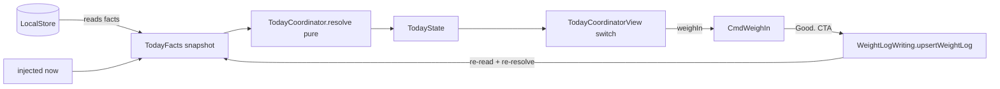

# Today coordinator + CmdWeighIn

Created 2026-06-13 from an AI planning session (team skill, AUTHOR_PLAN mode). Revised 2026-06-13 (revision round 1) to incorporate plan-judge findings.

Source of truth: docs/design/design.v5.md (v5)

## Overview

Replace the `ContentView` "Act." placeholder with the real Today surface so the app is usable past onboarding. This milestone delivers (a) a renderer-free `TodayCoordinator` — a pure resolver over injected facts that returns exactly one `Cmd*` state per the design.v5 Today-coordinator `stateDiagram-v2`, with every `Cmd*` state *named* but only `CmdWeighIn` *built*; and (b) the first real screen, `CmdWeighIn`, with HealthKit body-mass pre-fill and the `CmdWeightPad` manual/stale fallback, whose lime "Good." CTA writes a `WEIGHT_LOG` via a named `WeightLogWriting` seam and advances the coordinator. Architecture mirrors the shipped Onboarding split (renderer-free `@Observable` model + dumb `View` switch + injected protocol seams), so later `Cmd*` screens slot in without reshaping the coordinator.

## Architecture

### How Today mirrors Onboarding

| Onboarding (shipped) | Today (this milestone) |
|---|---|
| `OnboardingStep` (linear enum) | `TodayState` (enum: every `Cmd*` state in design.v5; only `.weighIn` rendered) |
| `OnboardingFlowModel` (progression) | `TodayCoordinator.resolve(facts:) -> TodayState` (pure resolver) |
| `OnboardingCoordinatorModel` (`@Observable`, renderer-free) | `TodayCoordinatorModel` (`@Observable`, renderer-free) |
| `OnboardingCoordinatorView` (dumb switch) | `TodayCoordinatorView` (dumb switch) |
| `HealthAuthorizationRequesting` seam | `BodyMassReading` seam (renderer-free read protocol) |
| `OnboardingProfileStore` (read+write seam) | `TodayFactsReading` (read seam) + `WeightLogWriting` (write seam) |

### The pure-resolver decision (recommended: injected snapshot, not direct store reads)

The coordinator takes an injected immutable **`TodayFacts`** snapshot and `resolve` is a pure function of it. Justification: it keeps the heart of the milestone — exhaustive coverage of the design.v5 state machine — testable as plain value-in/value-out unit tests with zero database, zero clock, zero SwiftUI, exactly as `OnboardingFlowModelTests`/`RootDestinationTests` already do. `TodayCoordinatorModel` is the impure shell: it calls `TodayFactsReading` (backed by `LocalStore`) to build the snapshot, holds it as `@Observable` state, and re-resolves after a write. Reading the store inside the resolver would force a DB fixture into every transition test and couple the state machine to GRDB — rejected.

### Anchor type contract (load-bearing seam — spell out the types)

This is the seam that makes `PreWake → WeighIn` actually fire, so the types are fixed here:

- **Storage.** `ProfileRow.wakeTime`, `.mealWindowStart`, `.bedTime` are `String` "HH:mm" wall-clock values (verified in `ios/Act/Persistence/Rows/ProfileRow.swift`). `TodayFacts` stores `wakeTime`, `mealWindowStart`, `bedTime` as **`DateComponents` (hour + minute only)** — *not* `Date`, *not* `String`. A `DateComponents` anchor is date-free and timezone-free, so the same fact snapshot is valid for any "today".
- **Parse seam.** `TodayFactsReading` (the `LocalStore` impl) parses each `ProfileRow` "HH:mm" string into `DateComponents(hour:minute:)` before vending the snapshot. Parsing lives in the reader, never in the resolver.
- **Reconstruct in the resolver.** `TodayCoordinator.resolve` reconstructs today's anchor `Date` by combining each `DateComponents` with `Calendar(identifier: .gregorian)` in `TimeZone.current`, evaluated against `facts.now` (take `now`'s y/m/d, splice in the anchor's hour/minute). This is the **same `Calendar(identifier: .gregorian)` + `TimeZone.current` pattern `recomputeAdherencePct` already uses** (`ios/Act/Persistence/LocalStore.swift:50,61,429`). The `PreWake → WeighIn` edge is then `facts.now >= reconstruct(facts.wakeTime, on: facts.now)`.

### Weekday derivation (lift-day branch)

`resolve` derives the lift-day branch from `facts.now`'s weekday using `Calendar(identifier: .gregorian)` + `TimeZone.current` (NOT the UTC weekday of `now`). Lift days = Mon/Wed/Fri (design.v5 §Behavior and schedule), i.e. gregorian `weekday` components `2 / 4 / 6`. The resolver computes the weekday from `now` internally with that calendar; `TodayFacts` does not pre-bake a raw weekday integer (avoids an ambiguous-timezone field on the snapshot).

### Re-open invariant (no WeighIn loop)

Once `weighInLogged == true`, `resolve` must advance past WeighIn — it returns `.preWorkout` (lift day) or `.fasting` (non-lift day) and **never** `.weighIn` again. This is what makes the write→re-read→re-resolve loop terminate instead of bouncing back to the same screen. Note the invariant: `weighInLogged == true AND now < wake_time` is impossible (you cannot have logged today's weigh-in before today's wake), so the resolver need not (and must not) special-case it back to `.preWake`.

### Scope of the state machine this milestone

`TodayState` names every node from the design.v5 diagram: `preWake, weighIn, preWorkout, workout, swim, fasting, hydration, reheat, eat, walk, eod, sleep` (plus the `urge`/`withdrawal` modal overlays are deferred — see Out-of-scope). `resolve` implements only the transitions decidable from this milestone's facts: `PreWake → WeighIn` (`now >= wake_time`) and `WeighIn → {PreWorkout | Fasting}` (weigh-in logged AND lift-day?). Every other state is returned as itself with no built renderer; `TodayCoordinatorView` renders a single small **"not yet built"** black placeholder for any state other than `.weighIn`. Complete architecture, smallest-viable-change.

### Read-seam design (minimal now, extensible later)

`TodayFactsReading` exposes one method `func todayFacts(now: Date) throws -> TodayFacts`. For THIS milestone the `LocalStore` implementation answers "has today's weigh-in been logged" (count `WEIGHT_LOG` rows whose local-calendar day == today, mirroring the calendar-day bucketing already used in `upsertHydrationLog`) plus parses + surfaces the profile wall-clock anchors as `DateComponents`. `TodayFacts` carries placeholder `false` for the not-yet-built checks so later screens extend `TodayFacts` + the one query without touching the resolver's signature.

**Tech-debt note (ProfileRow coupling).** The read seam reads anchors off `ProfileRow` directly rather than widening the `Profile` routing projection (`PersistenceSupport.swift`). This avoids a drive-by change to onboarding routing and is acceptable now, but should be revisited when a Settings edit screen lets the user change wake/bed times — at that point a single anchor projection shared by routing, Today, and Settings is warranted.

### Write-seam design (named protocol, not the concrete store)

Introduce **`WeightLogWriting`** — `protocol WeightLogWriting: AnyObject { func upsertWeightLog(_ row: WeightLogRow) throws }` — analogous to `OnboardingProfileStore` (`ios/Act/Onboarding/OnboardingProfileStore.swift`). `LocalStore` conforms (it already has `upsertWeightLog(_:)` at `LocalStore.swift:167`; the conformance is additive). `TodayCoordinatorModel` is injected with `WeightLogWriting`, **not** the concrete `LocalStore`, so model tests use a write spy with no GRDB.

### HealthKit body-mass read seam

`HealthKitService` currently reads only hydration; it has **no latest-body-mass read**. Introduce `BodyMassReading` (renderer-free protocol, mirroring `HealthAuthorizationRequesting`): `func latestBodyMassLb() async -> Double?` returning `nil` on denial/no-data/error (fail-open per design.v5 §Failure modes "HealthKit authorization denied"). For this milestone the production conformance is a stub that returns `nil` (the real anchored body-mass query is a deferred follow-up). A `nil` read lands the app on the `CmdWeightPad` "STALE · TAP TO ENTER" fallback, which is a valid shipped state. The model holds the injected reader; `CmdWeighIn` pre-fills when a value comes back, else shows the manual pad.

## Files to touch / create

Create (production):
- `ios/Act/Today/TodayState.swift` — the `Cmd*` state enum (every node named).
- `ios/Act/Today/TodayFacts.swift` — immutable snapshot value type (`now: Date`, anchors as `DateComponents`, check booleans) + `TodayFactsReading` protocol.
- `ios/Act/Today/TodayCoordinator.swift` — pure `resolve(facts:) -> TodayState` (no SwiftUI, no GRDB import); owns anchor `DateComponents`→`Date` reconstruction + gregorian/`TimeZone.current` weekday derivation.
- `ios/Act/Today/TodayCoordinatorModel.swift` — `@Observable` shell; builds facts via `TodayFactsReading`, writes via `WeightLogWriting`, re-resolves on write, owns the `BodyMassReading` reader.
- `ios/Act/Today/BodyMassReading.swift` — renderer-free body-mass read seam + production `nil`-returning stub (created within the model sub-task, see Sub-tasks).
- `ios/Act/Today/WeightLogWriting.swift` — renderer-free write seam (protocol).
- `ios/Act/Today/Views/TodayCoordinatorView.swift` — dumb switch; `.weighIn → CmdWeighIn`, all else → small placeholder.
- `ios/Act/Today/Views/CmdWeighIn.swift` — weight hero (SF Mono), pre-fill vs `CmdWeightPad` fallback, single lime "Good." CTA.
- `ios/Act/Today/Views/CmdWeightPad.swift` — manual numeric entry (used by the stale/denied path).

Edit (production):
- `ios/Act/Persistence/LocalStore+TodayWrite.swift` (new, SRP) — `WeightLogWriting` conformance on `LocalStore` (delegates to the existing `upsertWeightLog`).
- `ios/Act/Persistence/LocalStore+Today.swift` (new, SRP) — `TodayFactsReading` conformance: today's-weigh-in count + "HH:mm"→`DateComponents` anchor parse.
- `ios/Act/Onboarding/RootModel.swift` — construct/own a `TodayCoordinatorModel`, expose it for the `.today` case (mirrors how it owns `onboardingModel`); inject the `BodyMassReading` reader, `TodayFactsReading`, and `WeightLogWriting`.
- `ios/Act/App.swift` — pass the production seams (body-mass stub, `LocalStore` as reader/writer) into `RootModel`, same DEBUG-flag pattern as the health/notification authorizers.
- `ios/Act/RootView.swift` — `.today` renders `TodayCoordinatorView(model:)` instead of `ContentView()`; update the doc comment.

Delete:
- `ios/Act/ContentView.swift` — replaced. Safe: `ios/project.yml` `sources:` is **directory-based** (`path: Act`, no per-file enumeration — verified), so deleting the file + `xcodegen generate` regenerates the project cleanly with no dangling source reference. Not a rule file.

Edit (tests):
- `ios/ActUITests/OnboardingFlowUITests.swift` — bootstrap now lands on `CmdWeighIn`, not "Act."; update the final assertion to the weigh-in hero word and the `10-Today` screenshot label.

Create (tests):
- `ios/ActTests/Coordinators/TodayCoordinatorTests.swift` — exhaustive resolver transitions.
- `ios/ActTests/Coordinators/TodayCoordinatorModelTests.swift` — facts→state, write→re-resolve, body-mass pre-fill vs nil-fallback (with `FakeBodyMassReader` + `FakeTodayFactsReader` + write spy).
- `ios/ActTests/Persistence/LocalStoreTodayFactsTests.swift` — today's-weigh-in detection across the local-midnight boundary; "HH:mm"→`DateComponents` anchor parse.
- `ios/ActTests/Snapshots/CmdWeighInSnapshotTests.swift` — pre-filled and stale/manual states.
- `ios/ActTests/Support/` fakes: `FakeTodayFactsReader`, `FakeBodyMassReader`, `WeightLogWritingSpy` (mirroring the existing Spy/Fake pattern).
- Snapshot PNGs under `ios/ActTests/__snapshots__/`.

## Sub-tasks

Sequenced so each lands green and independently mergeable. **Seven sub-tasks.**

1. **`TodayState` enum + pure `TodayCoordinator.resolve`.**
   - Red: `TodayCoordinatorTests` asserts, given `TodayFacts` (anchors as `DateComponents`, `now: Date`): `now < wake_time → .preWake`; `now >= wake_time && !weighInLogged → .weighIn`; `weighInLogged && lift-day → .preWorkout`; `weighInLogged && non-lift-day → .fasting`. Lift-day branch tested via gregorian/`TimeZone.current` weekday (Mon=2/Wed=4/Fri=6), with a counter-case proving UTC-weekday would mis-classify near a TZ midnight. **Re-open invariant tests:** `weighInLogged == true` must return `.preWorkout`/`.fasting` and **never** `.weighIn` again (re-resolve after the write must not loop back); document that `weighInLogged == true && now < wake_time` is impossible by invariant (no test needed for the impossible case, but assert the happy re-resolve path terminates). Exhaustiveness guard so every named state is covered.
   - Green: enum + pure resolver, including `DateComponents`→`Date` anchor reconstruction with `Calendar(identifier: .gregorian)` + `TimeZone.current`. No SwiftUI, no GRDB.

2. **`TodayFacts` + `TodayFactsReading`; `LocalStore` read conformance.**
   - Red: `LocalStoreTodayFactsTests` — a `WEIGHT_LOG` logged "today" (local calendar) sets `weighInLogged == true`; one logged yesterday near local midnight does not; anchors come back parsed from `ProfileRow` "HH:mm" into `DateComponents(hour:minute:)`. In-memory store harness (`LocalStoreTestSupport`).
   - Green: `TodayFacts` value type (anchors `DateComponents`) + `LocalStore+Today.swift` impl reusing the calendar-day bucketing from `upsertHydrationLog` and an "HH:mm"→`DateComponents` parse helper.

3. **`WeightLogWriting` seam + `LocalStore` write conformance.**
   - Red: a `LocalStore` test that `WeightLogWriting.upsertWeightLog(_:)` persists a `WEIGHT_LOG` row (round-trips through the in-memory store), plus a `WeightLogWritingSpy` for downstream model tests.
   - Green: `WeightLogWriting.swift` protocol + `LocalStore+TodayWrite.swift` conformance delegating to the existing `upsertWeightLog`.

4. **`TodayCoordinatorModel` (`@Observable` shell) + `BodyMassReading` seam.**
   - Red: `TodayCoordinatorModelTests` — model resolves from injected `FakeTodayFactsReader`; `logWeighIn(lb:)` calls the injected `WeightLogWriting` (spy) then rebuilds facts and re-resolves (e.g. `.weighIn → .fasting`, proving the re-open invariant end-to-end); body-mass pre-fill = `FakeBodyMassReader` value, falls back to manual when the reader returns `nil`. The `BodyMassReading` production stub's `nil` return is exercised here via the model's fallback path (no standalone nil-stub test — a nil-returning stub has no meaningful red).
   - Green: create `BodyMassReading.swift` (protocol + `nil`-returning production stub) and the model wiring; `@ObservationIgnored` task handle for the async body-mass read, mirroring `OnboardingCoordinatorModel`'s drain contract.

5. **`CmdWeightPad` view (manual numeric entry).**
   - Red: snapshot test of the pad ("STALE · TAP TO ENTER" tag + numeric entry, SF Mono). Reference PNG recorded on the iOS 26.5 renderer; the local renderer matches CI, so a **local record** (`TEST_RUNNER_SNAPSHOT_TESTING_RECORD=all`) is acceptable here — record before flipping the test to green and commit the PNG.
   - Green: view built from `OnbShell`-style primitives (`ACTTokens`, locked colors, single lime CTA).

6. **`CmdWeighIn` view (hero + pre-fill/fallback + "Good." CTA).**
   - Red: `CmdWeighInSnapshotTests` — pre-filled state (HealthKit value, SF Mono hero) and stale/manual state (uses `CmdWeightPad`). Both reference PNGs recorded on iOS 26.5 (local record acceptable, renderer matches CI — record + commit before green).
   - Green: view bound to `TodayCoordinatorModel`; "Good." invokes `logWeighIn`.

7. **Wiring + placeholder switch + delete `ContentView` + onboarding integration walk.**
   - Red: extend `RootModelTests` to assert `.today` exposes a non-nil `todayModel`; `TodayCoordinatorView` renders `CmdWeighIn` for `.weighIn` and the placeholder otherwise. Update `OnboardingFlowUITests` final assertion from "Act." to the `CmdWeighIn` hero word (keep the `Shop.`-left assertion; update the `10-Today` screenshot label). The UI test's new assertion may depend on a 26.5-recorded screenshot label only for evidence, not for pass/fail; if a snapshot reference is touched, record locally (renderer matches CI) and commit before green.
   - Green: `TodayCoordinatorView` switch; `RootModel` owns `todayModel` and injects the three seams; `RootView` `.today` case swapped; `App.swift` injects the seams; delete `ContentView.swift` and `xcodegen generate`. Capture the simulator screenshot evidence required for UI PRs (per MEMORY: simulator-screenshots-in-prs).

## Out of scope

- Every `Cmd*` screen other than `CmdWeighIn` (`CmdPreWorkout`, `CmdMeal`/`Eat`, `CmdWalk`, `CmdEOD`, `CmdReheat`, `CmdSwim`, `CmdHydration`, `CmdRecovery`, etc.). Named in `TodayState`; render a placeholder.
- `Urge` and `Withdrawal` modal overlays — deferred; no modal presentation wired this milestone.
- The real HealthKit anchored body-mass query (the seam ships; production read is a `nil`-returning stub, landing on the manual pad).
- Local-notification registration / `BGAppRefreshTask` re-anchoring (deferred to the notification-scheduling subsystem per design.v5 §Behavior and schedule).
- CloudKit retry-queue changes; `upsertWeightLog` already propagates the weight + PROFILE deltas best-effort — reuse as-is.
- Widening the `Profile` routing projection with wall-clock fields (read anchors off `ProfileRow` in the read seam instead; revisit at the Settings edit screen — see tech-debt note).
- Any cessation/hydration state-machine work beyond the named states the resolver branches on.

## Open questions

1. **CmdWeighIn hero word.** design.v5 §Behavior and schedule names the screen `CmdWeighIn` and the CTA "Good.", and the onboarding UI test enumerates onboarding hero words but not Today's. What is the exact weigh-in hero word (e.g. `Weigh.`)? Load-bearing for the UI-test assertion in sub-task 7. Route to user. (Default if unanswered: `Weigh.`, matching the `OnbScale` "Weigh." register.)
2. **PreWake rendering.** Before `wake_time`, the resolver returns `.preWake`. Is `.preWake` a built screen this milestone or part of the "not yet built" placeholder set? Recommend placeholder (smallest change); the realistic post-onboarding path is `now >= wake_time` anyway. Confirm.
3. **Real body-mass read in scope?** Recommend shipping the seam with a `nil` stub now (manual-pad path is fully valid and snapshot-covered) and doing the anchored HealthKit body-mass query as a dedicated follow-up. Confirm this split is acceptable rather than blocking the milestone on a real read.
